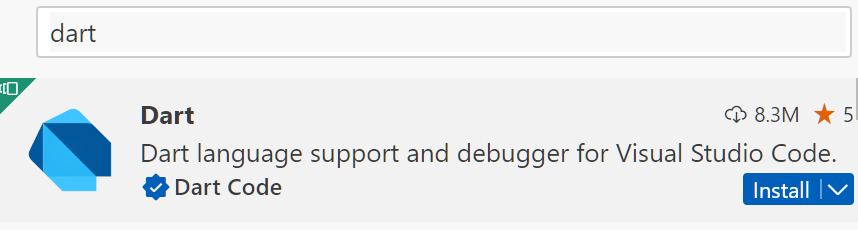
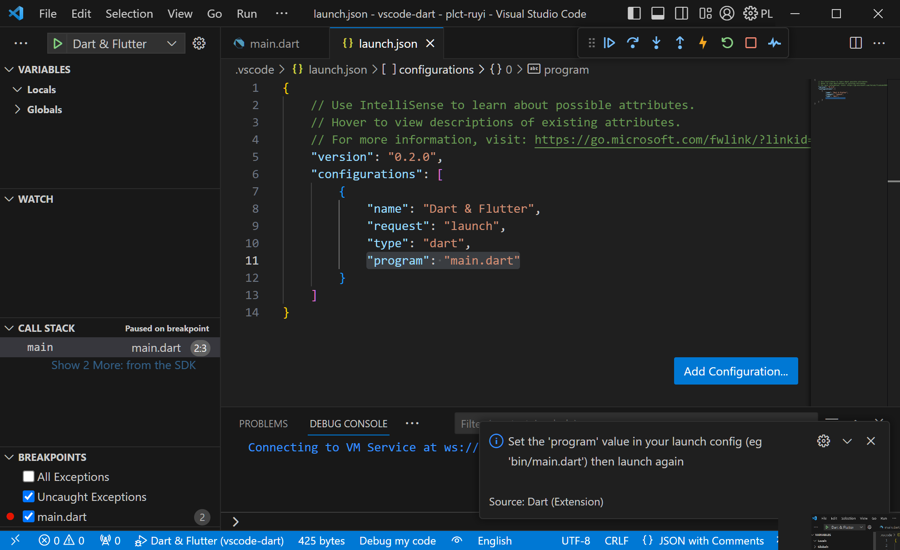
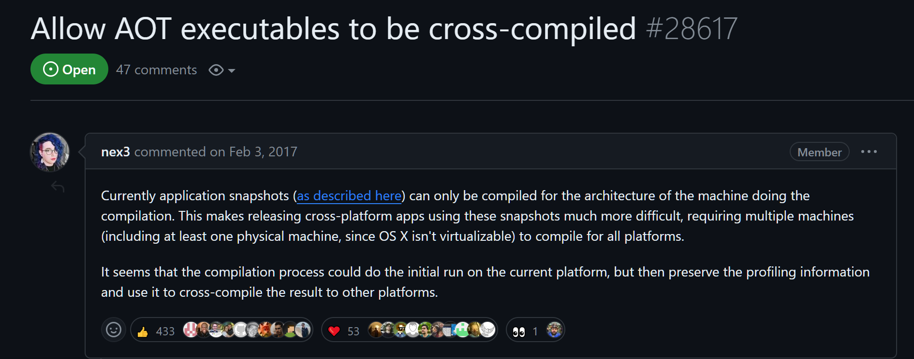
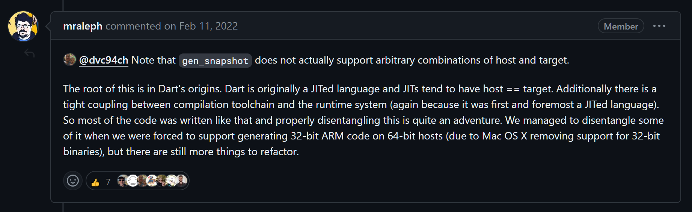
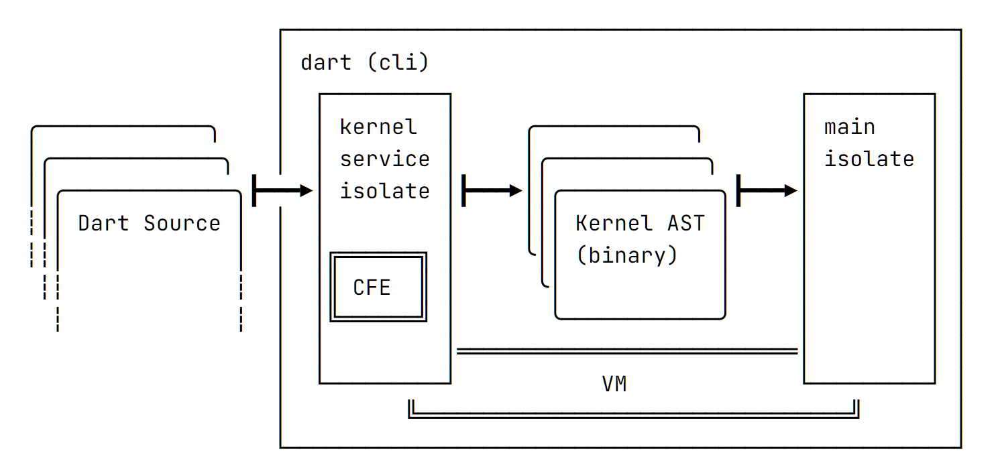
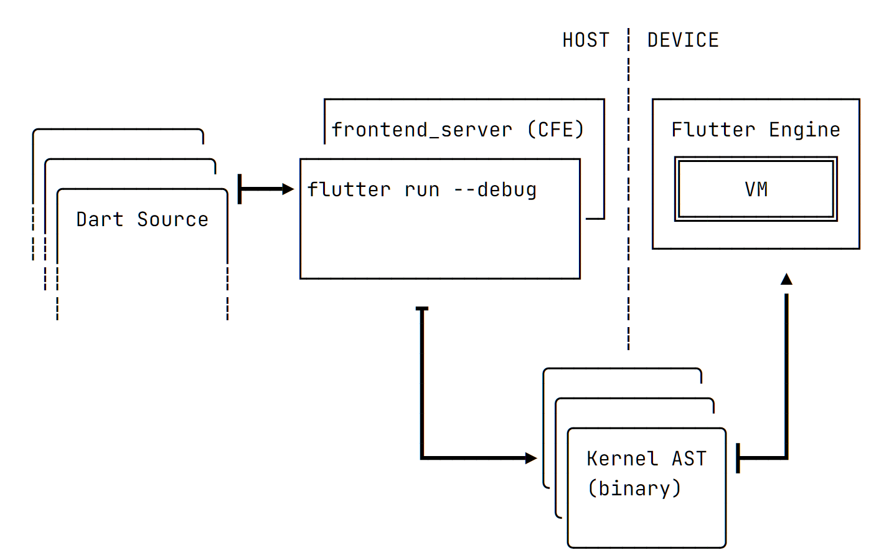
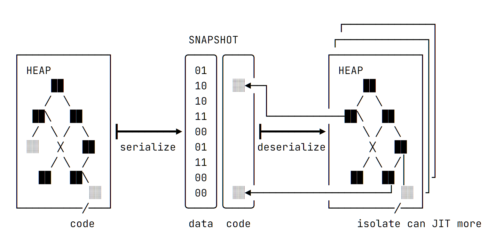
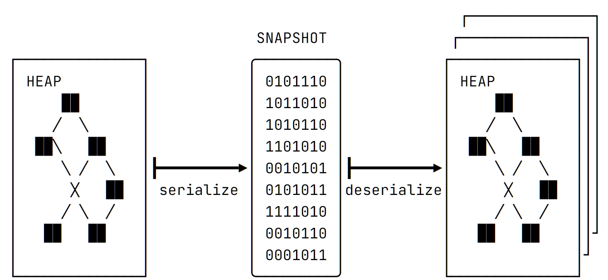
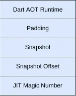

# dart 交叉编译调研

作者：第三测试小队 阎明铸
时间：2024-02-xx

# dart 语言

### 安装：<https://dart.cn/get-dart>

windows:

```bash
choco install dart
scoop install dart
```

linux:

```bash
sudo apt-get install dart
```

macos:

```zsh
brew tap dart-lang/dart
brew install dart
```

## 工具链/插件支持

dart 的工具链相对不错，并且有很好的 IDE 支持支持

- dart pub 依赖管理
- dart format 统一格式化
- dart compile 编译
- jetbrains 和 vscode 都可以安装 dart 插件获得相当稳定的 IDE 支持
- 内置的基于 web 和 ws 的 DevTools，分析程序的运行性能也很方便

    

## 编译运行

编译命令：`dart compile exe main.dart`

```bash
$ cat main.dart
void main() {
  print("hello world\n");
}

$ dart compile exe main.dart
$ ./main.exe
hello world
```

## 调试

安装完插件之后，可以直接按 F5, 配置项目入口文件即可



## 跨平台支持

- Windows
    - 支持的版本：Windows 10 和 11。
    - 支持的架构：x64、ia32、ARM64
    - ARM64 的支持处于实验性阶段，仅在 Dev 渠道可用。

- Linux
    - 支持的版本：已支持标准版的 Debian stable 以及 Ubuntu LTS。
    - 支持的架构：x64、IA32、ARM64、ARM、RISC-V (RV64GC)。
    - RISC-V 的支持目前还在预览阶段，仅在 dev 和 beta 渠道可用。

- macOS
    - 支持的版本：最新的三个主要版本。
    - 支持的架构：x64、ARM64。

## 交叉编译

dart compile exe 只支持本机编译，即 **host = target**, 并不支持交叉编译

issue: <https://github.com/dart-lang/sdk/issues/28617>




## 为什么不提供交叉编译支持？



- 其根源在于 Dart 最初是一种 JIT 语言，JIT 往往具有 host == target。
- 编译工具链和运行时系统之间存在紧密的耦合（依然是 JIT 导致）

## 可选方案

- Github Action Matrix
- 第三方 CI 平台 codemagic: <https://blog.codemagic.io/cross-compiling-dart-cli-applications-with-codemagic/>
- Hack(修改源代码) 😎：<https://medium.com/flutter-community/cross-compiling-dart-apps-f88e69824639>

## 疑问

### Q1: 为什么 flutter 可以在手机上调试？
### Q2: 明明有 AOT 模式为什么不能交叉编译？

## dart 编译 - 0

- 不编译，使用 JIT 模式直接运行：`dart run main.dart`

- 先编译后运行
    - js 模块：`dart compile js main.dart`
    - 独立可执行文件：`dart compile exe main.dart`
    - AOT (见下文，dart 2.6 添加)
    - JIT (见下文)
    - kernel (见下文)
> dart compile 原本分为：dart2native、dart2aot 和 dart2js 三部分

## dart 编译 - 1 js

dart 编译为 js 文件 并借助 node 运行

```bash
$ cat main.dart
void main() {
  print("hello world\n");
}

$ dart compile js main.dart
Compiled 9,949,235 input bytes (5,036,425 characters source) to 98,961
characters JavaScript in 1.29 seconds using 194.629 MB of memory

$ ls -lh
total 149K
-rw-r--r-- 1 trdth 197609  45 Feb 18 21:49 main.dart
-rw-r--r-- 1 trdth 197609 97K Feb 18 21:54 out.js
-rw-r--r-- 1 trdth 197609 11K Feb 18 21:54 out.js.deps
-rw-r--r-- 1 trdth 197609 36K Feb 18 21:54 out.js.map

$ node out.js
hello world
```

## dart 编译 - 2 jit, aot

...
- AOT 编译模块：`dart compile aot-snapshot main.dart`
    - **特定于架构**的文件，包含编译为**机器代码**的源代码
    - 没有 Dart 运行时
- JIT 编译模块：`dart compile jit-snapshot main.dart`
    - **特定于架构**的文件，包含所有源代码的**中间表示**形式
    - 包含程序训练运行期间执行的源代码的优化表示形式。(如果训练数据良好，JIT 编译的代码可以比 AOT 代码具有更快的峰值性能)
- kernel 模块：`dart compile kernel main.dart`
    - 源代码的**可移植中间表示**形式

## dart 编译 - 2 jit, aot

aot 模块运行

```bash
$ dart compile aot-snapshot bin/myapp.dart
Generated: /Users/me/myapp/bin/myapp.aot
$ dartaotruntime bin/myapp.aot
```

jit 模块运行

```bash
$ dart compile jit-snapshot bin/myapp.dart
Compiling bin/myapp.dart to jit-snapshot file bin/myapp.jit.
Hello world!
$ dart run bin/myapp.jit
Hello world!
```

## dart 编译 - 3 kernel

```bash
$ dart compile kernel bin/myapp.dart
Compiling bin/myapp.dart to kernel file bin/myapp.dill.
$ dart run bin/myapp.dill
```

dill: 抽象语法树 (AST) 的二进制形式。

由于依然是 AST, 不是机器代码，所以启动速度相比 AOT 要慢很多

## dart VM

**Introduction to Dart VM**: <https://mrale.ph/dartvm/>

- JIT
    - source (源代码)
    - kernel (AST 二进制)
- snapshot
    - AOT 快照
    - AppJIT 快照

主要区别在于 VM **何时** 以及 **如何** 将 Dart 源代码 **转换为可执行代码**

## 从 JIT 运行

source (源代码) 与 kernel (AST 二进制) 实际上是一回事

dart 不能直接执行源代码，`dart run` 会先把源代码转换为 AST, 在交付给 VM 运行



## A1: 为什么 flutter 可以在手机上调试？


对于 dart 来说，这两步发生在相同机器上，但是也可以分开

例如 flutter 就把编译到 kernel 放在主机 (开发机), 运行放在移动设备上进行



## 从 Snapshots 运行 - AppJIT

- 问题：原本的 JIT 以 Kernel (AST binary) 形式执行代码，对象，函数等只有用到才会加载并编译为机器代码，预热很慢。
- 解决方案：AppJIT 则通过使用模拟数据运行代码，提前生成 JIT 快照 实现加速预热的效果
- 现象：快照中既有机器代码，也有源代码



## 从 Snapshots 运行 - AppAOT

```bash
$ dart compile aot-snapshot bin/myapp.dart
Generated: /Users/me/myapp/bin/myapp.aot
$ dartaotruntime bin/myapp.aot
```

- 机器代码以堆快照的形式存在 (为了快速解压所有数据结构)
- 运行依赖预编译的 dart VM 变种




- 编译后的 AOT snapshot
- 预编译的 dartaotruntime

## hack 😎

所有可能调用的函数都被编译为机器代码，为什么不能交叉编译呢

作者从源代码中发现 dart2native(dart compile exe) 分为三步：

- 生成一个 AOT kernel
- 生成 AOT snapshot
- 把 AOT snapshot 与 dartaotruntime 时相结合。

第三步使通过 修改文件结构实现



## hack 😎

对于交叉编译，我们需要一个目标平台的 dartaotruntime, 还需要生成目标平台的 snapshot,

因此作者手动编译了对应平台的 gen_snapshot 和 dartaotruntime 两个命令行工具

为了使第三步拼接拥有正常的填充，偏移量等等，作者为 dart2native 添加了两个命令行参数，修改上面两个工具的入口

最后的命令：

```bash
 dart2native foo.dart \
    --gen-snapshot out/ProductSIMARM/dart-sdk/bin/utils/gen_snapshot \
    --aot-runtime out/ProductXARM/dart-sdk/bin/dartaotruntime
```

## A2 明明有 AOT 模式为什么不能交叉编译？

dart2native 既没有给出修改 gen_snapshot 和 dartaotruntime 的入口

也没有提供类似的二元组自动选择

## 总结

dart 目前可以借助 JIT 或 AOT 在 linux 系统本机编译 or 运行 RISC-V 目标的程序 (实验性)

目前不能在本机进行交叉编译 (除 flutter)

## 参考

- <https://dart.cn/tools/dart-compile>
- <https://github.com/dart-lang/sdk/issues/28617>
- <https://mrale.ph/dartvm/>

## end