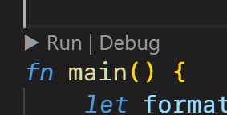
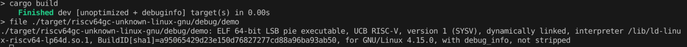
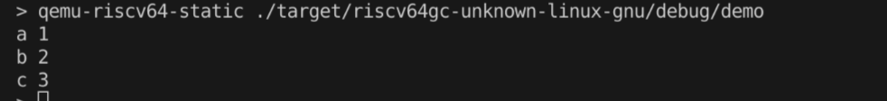
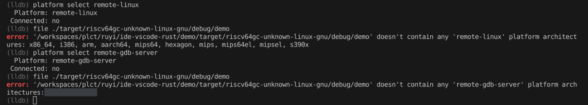
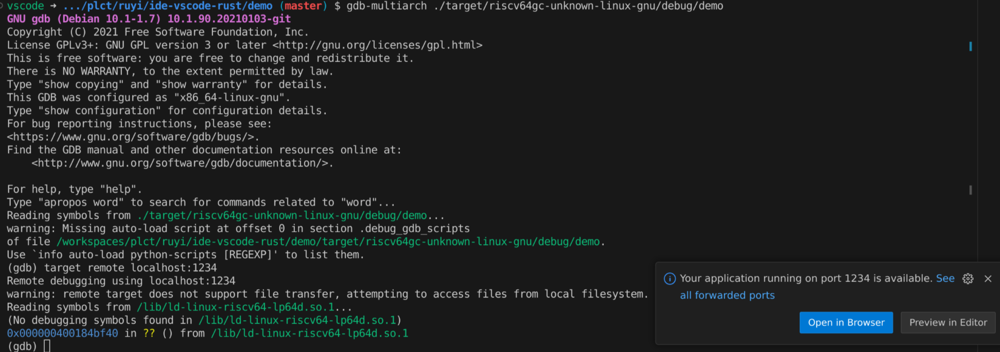
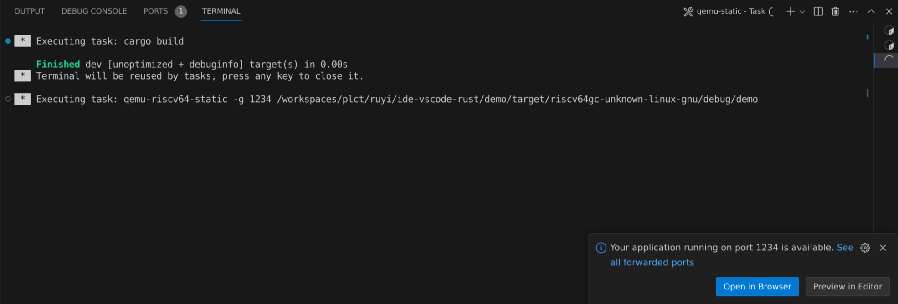
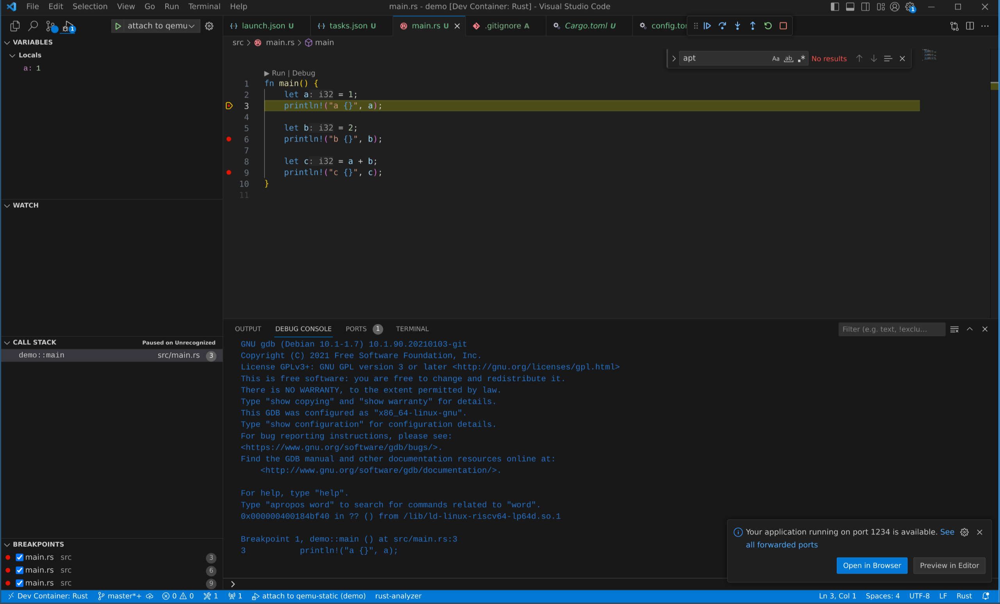
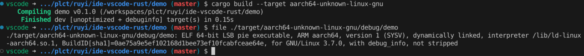

# vscode rust 插件调研

本文内容均在 Ubuntu 22.04 docker 容器下进行，rust 版本 1.75.0

## 安装

插件名称：rust-analyzer

插件下载地址：<https://marketplace.visualstudio.com/items?itemName=rust-lang.rust-analyzer>

> 注意该插件可能和 [官方插件](https://marketplace.visualstudio.com/items?itemName=rust-lang.rust) 产生冲突，后者已经不再维护

插件安装完成后会自动下载 rust-analyzer 二进制文件

注意事项：

1. rust-analyzer 需要标准库的源代码。如果源代码不存在，rust-analyzer 将尝试自动安装它。若要手动添加源，请运行以下命令：

    ```bash
    rustup component add rust-src
    ```

    > 只有最新的稳定标准库源代码才被正式支持与 rust-analyzer 一起使用。如果使用的是较旧的工具链，rust-analyzer 可能无法理解 Rust 源代码。需要更新工具链或使用与工具链兼容的旧版本的 rust-analyzer。
    `{ "rust-analyzer.server.extraEnv": { "RUSTUP_TOOLCHAIN": "stable" } }`

2. 仅支持两个最新版本的 VS Code

3. 如果 vscode 插件自动下载的插件在某些发行版 (不受支持的平台) 无法正常运行，可以手动下载或者编译获取 rust-analyzer 二进制文件，并路径添加到 `settings.json`：`{ "rust-analyzer.server.path": "~/.local/bin/rust-analyzer-linux" }`

## 工程管理

rust-analyzer 插件几乎不提供任何直接的按钮，只有编译，调试，运行测试 

工程管理完全依赖于命令行

`cargo new <progect_name>`

## 如何使用插件

rust-analyzer 会自动检查项目目录下的 `Cargo.toml` 文件运行代码静态检查

包含所有代码补全，高亮，跳转等功能

## 编译

准备：

- `rustup target add riscv64gc-unknown-linux-gnu -y` (添加目标平台工具链)
- `sudo apt install gcc-riscv64-linux-gnu -y` (添加目标平台链接器)

对于 riscv target 项目的编译，有两种方式

- 添加配置文件 (`.cargo/config.toml`) 指定 target, 并设置对应的链接器

    ```toml
    # 设置默认目标架构
    [build]
    target = "riscv64gc-unknown-linux-gnu"

    # 设置各架构配置
    [target.riscv64gc-unknown-linux-gnu]
    linker = "riscv64-linux-gnu-gcc"
    ```

    之后直接运行 `cargo build`

- 在命令行添加参数 `cargo build --target riscv64gc-unknown-linux-gnu`



## 运行

准备：

- `sudo cp /usr/riscv64-linux-gnu/lib/* /lib/`
- `sudo apt install qemu-user-static`

直接运行：`qemu-riscv64-static ./target/riscv64gc-unknown-linux-gnu/debug/demo`



## 调试

本机调试，可以直接使用 [CodeLLDB](https://marketplace.visualstudio.com/items?itemName=vadimcn.vscode-lldb) 插件调试 rust 程序

或者使用 gdb, rust-gdb 在命令行调试

## 使用 qemu 进行交叉编译调试

- `sudo apt install gdb-multiarch`

### CodeLLDB



- 对于 remote-linux: 支持 x86_64, i386, **arm**, aarch64, mips64, hexagon, mips, mips64el, mipsel, s390x
- 对于 remote-windows: 支持 i686, x86_64, i386, i38
- 对于 remote-macosx: 支持 x86_64, i386
- 对于 **remote-gdb-server**: 均不支持

似乎并不支持对 riscv 架构的远程调试

> CodeLLDB supports AArch64, ARM, AVR, MSP430, RISCV, X86 architectures and **may be** used to debug on embedded platforms via remote debugging.

### gdb

gdb 可以正常进行远程调试

命令行方式：

1. 启动 qemu-user-static, 使用 `-s` 参数模拟 gdbserver

    ```bash
    qemu-riscv64-static -g 1234 ./target/riscv64gc-unknown-linux-gnu/debug/demo
    ```

2. 启动 gdb-multiarch

    ```bash
    gdb-multiarch target/riscv64gc-unknown-linux-gnu/debug/demo
    (gdb) set architecture riscv:rv64
    (gdb) target remote localhost:1234
    ```

    

### VScode 可视化

1. `task.json`

    第一个 task 用于编译，第二个 task 用于启动 `qemu-user-static`

    ```json
    {
        "version": "2.0.0",
        "tasks": [
            {
                "label": "build",
                "type": "shell",
                "command": "cargo",
                "args": [
                    "build"
                ]
            },
            {
                "label": "qemu-static",
                "type": "shell",
                "isBackground": true,
                "dependsOn": [
                    "build"
                ],
                "command": "qemu-riscv64-static -g 1234 ${workspaceFolder}/target/riscv64gc-unknown-linux-gnu/debug/demo",
                "problemMatcher": [
                    {
                        "pattern": [
                            {
                                "regexp": ".",
                                "file": 1,
                                "location": 2,
                                "message": 3
                            }
                        ],
                        "background": {
                            "activeOnStart": true,
                            "beginsPattern": ".",
                            "endsPattern": "."
                        }
                    }
                ]
            }
        ]
    }
    ```

2. `launch.json`

    下面的配置仅仅是对 gdb 命令做的简单包装

    > 此处以 `coolchyni.beyond-debug` 插件为例，换用 cpp 插件也可以实现

    ```json
    {
        "version": "0.2.0",
        "configurations": [
            {
                "name": "attach to qemu-static",
                "type": "by-gdb",
                "request": "launch",
                "debuggerPath": "gdb-multiarch",
                "program": "${workspaceFolder}/target/riscv64gc-unknown-linux-gnu/debug/demo",
                "cwd": "${workspaceRoot}",
                "commandsBeforeExec": [
                    "set substitute-path '/rustc/82e1608dfa6e0b5569232559e3d385fea5a93112' '/usr/local/rustup/toolchains/1.75.0-x86_64-unknown-linux-gnu/lib/rustlib/src/rust'",
                ],
                "remote": {
                    "enabled": true,
                    "address": "localhost:1234",
                    "mode": "remote",
                }
            },
        ]
    }
    ```

3. 解决无法单步调试进入标准库

    注意 commandsBeforeExec 选项里的 `set subtitude-path ...` 命令设置源代码映射，左侧为调试器显示路径，右侧为编译工具链路径

    - 参考：<https://www.reddit.com/r/learnrust/comments/c3o8sr/how_to_step_into_standard_library_functions_while/>

4. 启动调试

    - 按下 `ctrl-shift-P`, 输入 `Tests: Run Task`, 首先启动 `qemu-static`

        

    - 按下 F5 即可启动调试

        

## TODO 真机远程调试

以树莓派 3B 为例：

```toml
[target.armv7-unknown-linux-gnueabihf]
linker = "arm-linux-gnueabihf-gcc"
```

```bash
rustup target add armv7-unknown-linux-gnueabihf
sudo apt install -y arm-linux-gnueabihf-gcc
cargo build --target armv7-unknown-linux-gnueabihf
```

```json
{
    "name": "Remote attach",
    "type": "lldb",
    "request": "launch",
    "program": "${workspaceFolder}/target/armv7-unknown-linux-gnueabihf/debug/demo", // Local path.
    "initCommands": [
        "platform select remote-linux", // For example: 'remote-linux', 'remote-macosx', 'remote-android', etc.
        "platform connect connect://192.168.100.109:1234",
        "settings set target.inherit-env false", // See note below.
    ],
},
```


