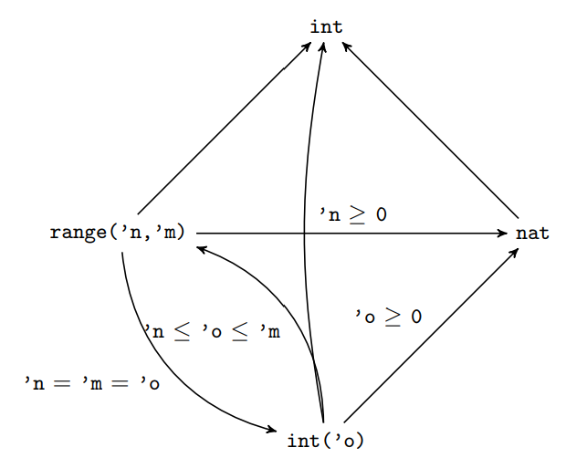
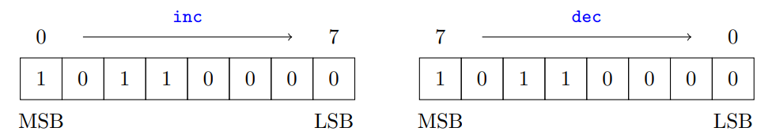
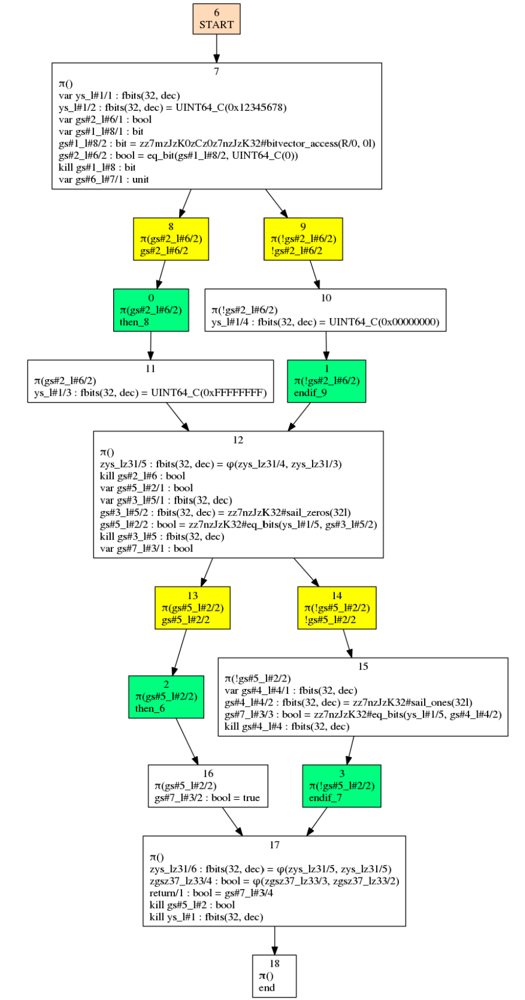

# Sail

## 1 语言简介

Sail 是一种用于描述处理器的指令集架构 (ISA) 语义的语言。

- Sail 旨在提供一种工程师友好、类似供应商伪代码的语言来描述指令语义。
- 它本质上是一种一阶命令式语言，但对数值类型和位向量长度具有轻量级依赖类型，这些类型和位向量长度使用 Z3 自动检查。

资源：

- [手册 (pdf)](https://github.com/rems-project/sail/blob/sail2/manual.pdf)
- [手册的 tex 格式源代码 + 示例代码](https://github.com/rems-project/sail/tree/sail2/doc)

### 为什么用 sail

供应商通常使用 白话文、表格和伪代码 来描述其 ISA 的行为。

但是不同供应商的伪代码在精确程度上各不相同：

- 对于 x86，Intel 伪代码只是暗示性的，嵌入了一些白话文。而 AMD 的只是白话文。
- 对于 IBM Power，有详细的伪代码，最近变成机器处理的。
- 对于 ARM，有详细的伪代码，最近变成了机器处理的。
- 对于 MIPS，有相当详细的伪代码。

sail 要实现的目标

- 支持对真实世界 ISA 语义的精确定义
- 容易，对熟悉现有供应商伪代码的人可以轻松掌握，Sail 的风格与 ARM 和 IBM Power 使用的伪代码相似 (语法差异很小);
- 提供将顺序 ISA 语义 (sequential ISA semantics) 与已开发的松弛内存并发模型 (elaxed-memory
concurrency models) 相结合所必需的结构
- 提供一个富有表现力的类型系统，可以静态检查这些规范中出现的位向量长度和索引，检测错误并支持代码生成，具有类型推断功能，最大程度地减少所需的类型注释
- 支持运行，对架构进行自动化完整仿真
- 支持自动生成 定理证明器定义，用于对 ISA 规范进行机械化推理
- 尽可能减少代码生成和理论定义生成

### Sail spec

一个 Sail Spec 通常会定义：

- 机器指令的抽象语法类型 (AST)
- 一个将二进制值转换为 AST 值的解码函数
- 描述每个指令在运行时行为的执行函数
- 任何所需的任何辅助函数和类型

给定这样的规范后，Sail 实现可以对其进行类型检查并生成：

- 完全类型注释的定义 (定义的深度嵌入) 的内部表示形式，可由 Sail 解释器执行。这些都用 Lem(一种类型、函数和关系定义的语言，可以编译成 OCaml 和各种定理证明器) 表示。Sail 解释器还可用于分析指令定义 (或部分执行的指令)，以确定其潜在的寄存器和内存占用情况。

- 定义的浅层嵌入 (同样是用 Lem 编写)，可以直接地执行或转换为定理证明器代码。目前，这主要面向 `Isabelle/HOL` 或 `HOL4`，尽管 Sail 依赖类型应该支持生成惯用的 Coq 定义 (直接而不是通过 Lem)。
- 直接编译成 OCaml 的 Spec 的编译版本。
- 编译成 C 代码的高效可执行版本。

### 不足

Sail 目前不支持描述指令的汇编语法，也不支持汇编语法与指令 AST 或二进制描述之间的映射，尽管这是我们计划添加的内容。Sail 已被用于开发几种架构的部分模型。

## 2 快速入门

我们通过 RISC-V 模型中的一个小例子来介绍 Sail 的基本功能，该模型仅包含两个指令：`add immediately` 和 `load double`。

这里定义了默认顺序，并且引入了 Sail prelude.

> 见后续，可以暂时理解为向量的索引方向，prelude 即为内置函数库

```ocaml
default Order dec
$include <prelude.sail>
```

Sail 的 prelude 非常少，Sail 规范通常会建立在它的基础上。一些 Sail 规范源自预先存在的伪代码，这些伪代码已经使用了特定的习惯用语——我们的 Sail ARM 规范使用 ZeroExtend 和 SignExtend 镜像一份 ASL 代码，而我们的 MIPS 和 RISC-V 规范使用 EXTZ 和 EXTS 来实现相同的功能。因此，在此示例中，我们将零扩展 (ZeroExtend) 和符号扩展 (SignExtend) 函数定义为：

> 零扩展和符号扩展是两种数据扩展方式，通常用于处理不同位宽的数据，零扩展是指将高位用零填充，不改变原始数据的符号位。符号扩展是指将高位用数据的符号位填充，以保持原始数值的符号

```ocaml
val EXTZ : forall 'n 'm, 'm >= 'n. (implicit('m), bits('n)) -> bits('m)

function EXTZ(m, v) = sail_zero_extend(v, m)

val EXTS : forall 'n 'm, 'm >= 'n. (implicit('m), bits('n)) -> bits('m)

function EXTS(m, v) = sail_sign_extend(v, m)
```

现在，我们定义一个整数类型同义词 xlen，在本例中，该同义词将等于 64。Sail 支持对常规类型和整数 (类比 C++ 中的常量泛型，但这里更具表现力) 的定义。我们还为长度为 xlen 的位向量 (bit vector) 创建类型 xlenbits。

```ocaml
type xlen : Int = 64

type xlen_bytes : Int = 8

type xlenbits = bits(xlen)
```

在此示例中，我们还为长度为 5 的位向量引入了一个类型同义词，它表示寄存器。

```ocaml
type regbits = bits(5)
```

现在，我们设置一些基本的架构状态：

```ocaml
(* 首先为程序计数器 PC 和下一个程序计数器 nextPC 创建一个 xlenbit 类型的寄存器。 *)
register PC : xlenbits
register nextPC : xlenbits

(* 我们将通用寄存器定义为 32 个 xlenbits 位向量的向量。 *)
(* 在此示例中，dec 关键字并不重要，但 Sail 支持两种不同的(bit)vectors *)
(* - inc 最高有效位为零 *)
(* - dec 最低有效位为为零。 *)
register Xs : vector(32, dec, xlenbits)


(* 然后，我们为寄存器定义一个 getter 和 setter，确保对零寄存器进行特殊处理 *)
(* (在 RISC-V 中，寄存器 0 始终硬编码为 0) *)
val rX : regbits -> xlenbits

function rX(r) =
    match r {
        0b00000 => EXTZ(0x0),
        _ => Xs[unsigned(r)]
    }

val wX : (regbits, xlenbits) -> unit

function wX(r, v) =
    if r != 0b00000 then {
        Xs[unsigned(r)] = v;
    }

(* 最后，我们将读取(rX)和写入(wX)函数都重载为简单的 X。 *)
(* 这允许我们将寄存器写入为 X(r)= value，并将寄存器读取为 value = X(r) *)
(* Sail 支持灵活的临时重载 (ad-hoc overloading)，是表达式第一公民的语言，目的是允许类似伪代码的定义。 *)
overload X = {rX, wX}
```

我们还给出了一个用于读取内存的函数 MEMr，这个函数只指向我们在其他地方定义的内置函数。

```ocaml
val MEMr = monadic {lem: "MEMr", coq: "MEMr", _: "read_ram"}: forall 'n 'm, 'n >= 0.
(int('m), int('n), bits('m), bits('m)) -> bits(8 * 'n)
```

在定义架构规范时，将指令语义分解为多个单独的函数 (解码 (甚至可能在多个阶段) 为自定义的中间数据类型并执行解码指令) 很常见，

但是，通常希望将这些函数和数据类型的各个相关部分组合在一起，因为它们通常可以在 ISA 参考手册中找到。为了支持这一点，Sail 支持分散的定义。

首先，我们给出 execute 和 decode 函数的类型，以及 ast union:

```ocaml
enum iop = {RISCV_ADDI, RISCV_SLTI, RISCV_SLTIU, RISCV_XORI, RISCV_ORI, RISCV_ANDI}

scattered union ast

val decode : bits(32) -> option(ast)

val execute : ast -> unit
```

> TODO: scattered 见后续

现在，我们提供了 `add-immediate` 的 ast 类型子句，以及它的 `execute` 和 `decode` 子句。

解码函数的定义：直接对表示指令的位向量进行模式匹配

Sail 支持向量串联模式 (vector concatenation patterns)(@ 是向量串联运算符)，并使用已提供的类型 (例如 bits 和 regbits) 以正确的方式解构向量。

我们使用 `EXTS` 函数来对其参数进行符号扩展。

> TODO: 代码看不懂

```ocaml
union clause ast = ITYPE : (bits(12), regbits, regbits, iop)

function clause decode imm : bits(12) @ rs1 : regbits @ 0b000 @ rd : regbits @ 0b0010011
    = Some(ITYPE(imm, rs1, rd, RISCV_ADDI))

function clause execute (ITYPE (imm, rs1, rd, RISCV_ADDI)) =
    let rs1_val = X(rs1) in
    let imm_ext : xlenbits = EXTS(imm) in
    let result = rs1_val + imm_ext in
    X(rd) = result
```

接着是对 `load-double` 指令做同样的事情：

```ocaml
union clause ast = LOAD : (bits(12), regbits, regbits)

function clause decode imm : bits(12) @ rs1 : regbits @ 0b011 @ rd : regbits @ 0b0000011
    = Some(LOAD(imm, rs1, rd))

function clause execute(LOAD(imm, rs1, rd)) =
    let addr : xlenbits = X(rs1) + EXTS(imm) in
    let result : xlenbits = read mem(addr, sizeof(xlen_bytes)) in
    X(rd) = result
```

最后，我们定义解码函数的回退情况。请注意，分散函数中的子句将按照它们在文件中出现的顺序进行匹配。

## 3 使用 Sail

首先，Sail 是一个命令行工具，类似于编译器：输入一个 Sail 文件列表; sail 命令行工具会对它们进行类型检查并输出

如果你只是想对 Sail 文件进行类型检查，你可以直接在命令行上传递，没有其他选项，因此对于我们的 RISC-V spec 示例，我们可以这样做：

```bash
sail prelude.sail riscv_types.sail riscv_mem.sail riscv_sys.sail riscv_vmem.sail riscv.sail
```

在命令行上传递的 sail 文件列表会被简单地视为一个连接在一起的大文件，尽管解析器会跟踪每个文件的位置以进行错误报告。

在上面的例子中，该 spec 分为以下几个组件。

- `prelude.sail` 定义了初始类型环境和内置函数
- `riscv_types.sail` 给出了规范其余部分使用的类型定义
- `riscv_mem.sail` 和 `riscv_vmem.sail` 描述了物理和虚拟内存的交互
- `riscv_sys.sail` 和 `riscv.sail` 实现了大部分 spec。

对于更复杂的项目，你可以在 Sail 源代码中使用 `$include` 语句，例如：

```ocaml
$include <library.sail>
$include "file.sail"
```

在这个例子中，Sail 将在 `$SAIL_DIR/lib` 中查找 `library.sail`，其中 `$SAIL_DIR` 通常是 `sail` 仓库的根目录。它将相对于包含 `$include`的文件的位置搜索 `file.sail`。`$include`后的空格是必填项。Sail 还支持 `$define`、`$ifdef` 和 `$ifndef`。这些是 `Sail` 本身支持的东西，而不是单独的预处理器，并且会在 AST 解析后处理。

### 3.1 编译为 OCaml

要将 Sail 规范编译为 OCaml，可以这样调用 Sail:

```bash
sail -ocaml FILES
```

命令将产生一个翻译成 OCaml 语言的 spec 版本，该 spec 会被放置在一个名为 _sbuild 的目录中，类似于 ocamlbuild 的 `_build` 目录。生成的 OCaml 旨在与原始 Sail 源代码相当接近，目前我们不尝试对此输出进行太多优化。

_sbuild 目录的内容被设置为一个 ocamlbuild 项目，因此只需切换到该目录并运行下面的命令：

```ocaml
ocamlbuild -use-ocamlfind out.cmx
```

编译生成的模型。目前，OCaml 编译依赖于 `lem`、`linksem` 和 `zarith` 作为 ocamlfind 可查找库提供，并且环境变量 `$SAIL_DIR` 设置为 `Sail` 存储库的根目录。

如果 sail spec 包含一个 `unit -> unit` 类型的 `main` 函数，并且该函数实现了一个 `fetch/decode/execute loop`，那么 OCaml 后端可以生成一个能正常运行的文件：

```bash
sail -o out -ocaml FILES
```

运行方法：

```bash
./out ELF_FILE
```

如果你想模拟运行基于此 spec 的 ELF 文件。可以调用 `$include <elf.sail>` 来获得一些有用的函数，以便从 sail spec 中访问加载的 ELF 文件的信息。特别是 `elf.sail` 定义了一个函数 `elf_entry: unit -> int`，可用于将 PC 寄存器设置到正确的位置。ELF 加载由 `linksem` 库完成。

> 还有一个 `-ocaml_trace` 选项，它与 `-ocaml` 相同，只是它为生成的 OCaml 代码附加了 tracing 信息。

#### 3.1.1 OCaml 随机生成器支持

还有一些基本支持，用于为 sail 数据类型生成 `Quick-check` 样式的随机生成器。

> 注：Quick-Check 是一个由 Haskell 语言编写的自动化随机测试库

添加 `-ocaml_generators <type>` 选项将为每个类型产生一个 record type `generators`，并在名为 `rand_gens` 的 record 中生成一个 `generator` 的默认实现。生成器可以通过替换 `rand_gens` 中的单个字段来自定义，例如限制寄存器的选择。即使寄存器索引类型只是一个别名 (例如特定大小的位向量)，这也是可能的，因为每个类型名称都会生成单独的生成器。

例如，如果在第 2 节中为迷你 RISCV 生成 OCaml 输出时添加了 `-ocaml_generators ast`，则可以通过以下方式生成随机指令 AST：

```ocaml
let generated_ast = rand_gens.gen_zast rand_gens in ...
```

请注意，类型名称是 mildly encoded(温和编码？) 的。

对于每个 union 类型（如 ast），还提供了构造函数名称列表、constructors_zast 和函数 build_zast，以创建给定构造函数的实例。可以使用此功能的示例在 <https://github.com/rems-project/sail-riscv-test-generation> 中找到。

### 3.2 编译为 C

要将 Sail 编译为 C，请使用 -c 选项，如下所示：

```bash
sail -c FILES 1> out.c
```

默认情况下，翻译后的 C 语言打印为 stdout，但也可以使用 -o 选项输出到文件，下面将生成一个名为 out.c 的文件：

```ml
sail -c FILES -o out
```

要生成可执行文件，则需要与 sail/lib 目录中的 C 文件链接：

```bash
gcc out.c $SAIL_DIR/lib/*.c -lgmp -lz -I $SAIL_DIR/lib/ -o out
```

C 输出需要依赖于 GMP 库 (用于任意精度算术)，以及 zlib(用于处理压缩的 ELF 二进制文件)

下面列出了几个 Sail 选项会影响 C 输出：

- `-O` 打开优化。如果不设置此标志，生成的 C 代码将非常慢。
- `-Oconstant_fold` 使用常量折叠优化。
- `-c_include` 提供要包含在生成的 C 中的其他头文件。
- `-c_no_main` 不生成 `main()` 函数。
- `-static` 在可能的情况下，将生成的 C 函数标记为静态。对统计代码覆盖率很有用。

为 sail spec 生成的可执行文件（前提是生成了 main 函数）支持多个选项，用于将 ELF 文件和二进制数据加载到 spec 内存中。

- `-e/--elf` 将 ELF 文件加载到内存中。目前仅支持 AArch64 和 RISC-V ELF 文件。
- `-b/--binary` 将原始二进制数据加载到 spec 的内存中。它的使用方式如下：

    ```bash
    ./out --binary=0xADDRESS,FILE
    ./out -b 0xADDRESS,FILE
    ```

    提供的文件的内容将从给定地址开始放置在内存中，该地址必须以十六进制数形式给出。

- `-i/--image` 对于无法通过 `--elf` 标志加载的 ELF 文件，Sail 可以利用 linksem 转成一个特殊的 image file

    ```bash
    sail -elf ELF_FILE -o image.bin
    ./out --image=image.bin
    ```

    此标志的优点是它使用 Linksem 来处理 ELF 文件，因此它可以处理 linksem 能够理解的任何 ELF 文件。这也保证了加载到内存中的 ELF 二进制文件的内容与 OCaml 后端和解释器的内容完全相同，因为它们也在内部使用 Linksem 来加载 ELF 文件。

- `-n/--entry` 设置 elf_entry 函数返回的自定义入口点。必须是以 `0x` 为前缀的十六进制地址。
- `-l/--cyclelimit` 运行模拟，直到达到设定的循环数。spec 的主循环必须调用 `cycle_count` 函数才能正常工作。

### 3.3 Lem, Isabelle & HOL4

官方有一个单独的文档，详细介绍了如何从 Sail 模型生成 Isabelle 理论，以及如何在 Isabelle 中使用这些模型，请参阅：

[<https://github.com/rems-project/sail/raw/sail2/lib/isabelle/manual.pdf>](https://github.com/rems-project/sail/raw/sail2/lib/isabelle/manual.pdf)

目前，在 Sail 仓库的 `snapshots/isabelle` 中为我们的一些模型生成了 Isabelle 快照。提供这些快照只是为了方便，并不保证最新。

为了在 Isabelle 中打开其中一个 spec 的 theory，请使用 `-l Sail` 命令行标志来加载包含 Sail 库的会话。Sail 和 Lem 库的快照分别位于 `lib/sail` 和 `lib/lem` 目录中。您可以使用 `-d` 标志告诉 Isabelle 在哪里可以找到它们，例如：

```bash
isabelle jedit -l Sail -d lib/lem -d lib/sail riscv/Riscv.thy
```

当从 `snapshots/isabelle` 目录运行时，会打开 RISC-V spec。

### 3.4 交互模式

编译 Sail: `make isail`

使用 GHCi(译者注，ghc 是 haskell 的编译器，ghc 则是交互式命令行，类似于 ipython) 风格的交互式解释器构建它。你可以通过使用 `sail -i` 启动。如果 Sail 没有启用交互式支持进行编译，则 -i 标志不执行任何操作。Sail 仍能正常处理其他命令行参数，包括编译为 OCaml 或 Lem。还可以使用 `-is` 标志将命令列表传递给解释器，如下所示：

```bash
sail -is FILE
```

其中 FILE 包含命令列表。进入交互模式后，可以通过输入 `:commands` 来访问命令列表，`:help` 会为每个命令提供一些文档。

### 3.5 LTEX 生成

Sail 可用于在文档中生成 Latex，如下所示：

```bash
sail -o DIRECTORY -latex FILES
```

- FILES 列表是要为其生成 latex 的 Sail 文件列表
- DIRECTORY 是将放置生成的 latex 的目录。

文件列表必须是一系列有效的可类型检查的 Sail 文件。生成 latex 的目的是将其包含在用 Latex 编写的现有 ISA 手册中，因此 latex 输出为 `DIRECTORY/commands.tex` 中的每个顶级 Sail 声明生成命令列表。

本节的其余部分将讨论 latex 生成过程的已稳定特性——还有一些额外的特性，用于在 Sail 代码中包含 markdown doc-comments，并将它们格式化为 latex 以用于包含 ID 文档等 (原文：inclusion id documentation)，但这些特性还不完全稳定。本手册本身使用了 Sail latex 生成，因此可以使用 `doc/manual.tex` 和 `doc/Makefile` 来查看该生成过程。

**Requirements** 生成的 latex 使用 `listings` 包格式化源代码，使用 `etoolbox` 包中的宏生成命令，并依赖 `hyperref` 包进行交叉引用。这些软件包在大多数 TeX 发行版中都可用，并作为 Ubuntu 的 texlive 软件包的一部分提供。

**Usage** 由于 latex 环境的奇怪性，每个 Sail 声明都必须放在它自己的文件中，然后 `command.tex` 中的 command 包含在 `\lstinputlisting` 中。要将生成的 Sail 包含在文档中，可以执行以下操作：

```latex
\input{commands.tex}
\sailtype{my_type}
\sailval{my_function}
\sailfn{my_function}
```

其中包括 `my_type` 的类型定义、声明（`\sailval`）以及 `my_function` 的定义（`\sailfn`）。还有用于值定义和寄存器定义的 `\saillet` 和 `\sailregister` 宏。这些也可以与转义一起使用，例如 `my\_type`，这在定义更复杂的宏时很有用。

```latex
\input{commands.tex}
\prefixtype{my_type}
\prefixval{my_function}
\prefixfn{my_function}
```

生成的定义被包装在可自定义的宏中，你可以覆盖这些宏以更改 Sail 代码的格式。对于 `\sailfn`，有一个可以重新定义的宏 `\saildocfn`，对于其他 Sail 顶级类型也是如此。

**Cross-referencing(交叉引用)**：对于每个宏 `\sailX {id}`，都有一个宏 `\sailrefX {id}{text}`，它创建对原始定义的超引用 (hyper-ref)。这需要 `hyper-ref` 包。

### 3.6 其他选项

在这里，我们总结了 Sail 可用的大多数其他选项。调试选项（通常用于调试 Sail 本身）以字母 d 开头表示。

- `-v` 打印 Sail 版本。
- `-help` 打印选项列表。
- `-no_warn` 关闭警告。
- `-enum_casts` 允许枚举元素自动转换为数字。
- `-memo_z3` 记住对 Z3 求解器的调用。如果在开发时频繁对同一规范进行排版检查，这可以大大缩短排版时间。
- `-no_lexp_bounds_check` 关闭对赋值左侧变量的边界检查。
- `-no_effects` 关闭效果检查。可能会破坏一些假设效果已正确检查的后端。
- `-undefined_gen` 为用户定义的类型生成一个函数，这个函数会返回 undefined。每个类型 `T` 都会为其创建一个 `undefined_T` 函数。此标志由一些想要重写 `undefined` 的后端自动设置。
- `-just_check` 强制 Sail 在类型检查后立即终止。
- `-dno_cast` 强制 Sail 在任何情况下都不要进行类型强转。
- `-dtc_verbose <verbosity>` 使类型检查器打印出类型检查过程的 trace 记录。如果详细程度级别为 1，则这应该只包括关于检查和推理规则的相当可读的判断。如果详细程度为 2，则将包含大量调试信息。此选项可用于诊断棘手的类型错误，尤其是在错误消息不是很好的情况下。
- `-ddump_tc_ast` 类型检查后将类型检查的 AST 写入 stdout
- `-ddump_rewrite_ast <prefix>` 输出每个 pass 结束后的 AST。每个 pass 的输出都放置在以 `<prefix>` 开头的文件中。
- `-dsanity` 对 AST 执行额外的健全性检查。
- `-dmagic_hash` 允许在标识符中使用 `#` 符号。它目前被用作魔术符号，用于将生成的标识符与用户可以写入的标识符分开，因此此选项允许将各种其他调试选项的输出反馈到 Sail 中。

## 4 语法

### 4.1 函数

在 Sail 中，函数分为两部分

- 先使用 val 关键字编写函数的类型签名
- 然后使用 function 关键字定义函数的主体

在本小节中，我们手动实现 sail 标准库提供的 `replicate_bits` 函数。

参数：number, bitvector
功能：复制 bitvector n 次

```ocaml
```

Sail 中函数类型的一般语法如下：
    `val name : forall type variables , constraint . ( type1 , . . . , type2 ) -> return type`

`replicate_bits` 函数的实现如下：

```ocaml
val my_replicate_bits : forall 'n 'm, ('m >= 1 & 'n >= 1). (int('n), bits('m)) -> bits('n * 'm)

function my_replicate_bits(n, xs) = {
    ys = zeros(n * length(xs));
    foreach (i from 1 to n) {
        ys = ys << length(xs);
        ys = ys | zero_extend(xs, length(ys))
    };
    ys
}
```

函数声明的一般语法为：
    `function name ( argument1 , . . . , argumentn ) = expression`

> 此示例的代码在 Sail Repo 的 `doc/examples/my_replicate_bits.sail`。

如果想要测试，你可以使用 `-i` 选项以交互方式调用 Sail，在命令行上传递上述文件。输入 `my_replicate_bits(3, 0xA)` 将逐步执行上述函数，并最终返回结果 `0xAAA`. 在交互式解释器中输入 `:run` 将导致对表达式进行完全计算，而不是单步执行。

Sail 允许在表达式中直接使用类型变量，因此上面的内容可以重写为

```ocaml
function my_replicate_bits_2(n, xs) = {
    ys = zeros('n * 'm);
    foreach (i from 1 to n) {
        ys = (ys << 'm) | zero_extend(xs, 'n * 'm)
    };
    ys
}
```

> 这种写法简洁明了，但应谨慎使用。发生的情况是，Sail 将尝试使用周围范围内可用的适当大小的表达式 (在本例中为 n 和 length(xs)) 来重写类型变量。如果没有找到合适的表达式来轻易重写这些类型变量，则将自动添加其他函数参数以在运行时传递此信息。

函数也可以有隐式参数，例如，下面我们实现了一个零扩展函数，该函数可以从调用上下文中隐式获取其结果 bits 的长度：

```ocaml
val extz : forall 'n 'm, 'm >= 'n. (implicit('m), bits('n)) -> bits('m)

function extz(m, xs) = zero_extend(xs, m)
```

隐式参数始终是整数，并且它们必须首先出现在函数类型签名中的任何其他参数之前。

### 4.2 Map

Map 是 Sail 的一项功能，它允许简洁地表达 ISA 规范中常见的值之间的双向关系：例如，枚举类型的位表示形式或指令 AST 的汇编语言字符串表示形式。

它们的定义与函数类似，具有 val-spec 和 definition。目前，它们仅适用于单态类型。

`val name : type1 <-> type2`
`mapping name = { pattern <-> pattern , pattern <-> pattern , . . . }`

简写：`mapping name : type1 <-> type2 = { pattern <-> pattern , pattern <-> pattern , . . . }`

来自 RISC-V model 的一个例子：

```ocaml
mapping size_bits : word_width <-> bits(2) = {
    BYTE <-> 0b00,
    HALF <-> 0b01,
    WORD <-> 0b10,
    DOUBLE <-> 0b11
}
```

只需像调用函数一样调用映射即可使用映射：类型推断将确定映射的运行方向。(这导致了映射两侧的类型必须不同的限制)。

```ocaml
let width : word_width = size_bits(0b00);
let width : bits(2) = size_bits(BYTE);
```

映射是通过在编译时将它们转换为前向和后向函数以及一些辅助函数来实现的。

使用 val-spec 声明映射后，可以通过手动定义这些函数来实现它，而不是如上所述定义映射。这些函数及其类型包括：

```ocaml
val name_forwards : type_1 -> type_2
val name_backwards : type_2 -> type_1
val name_forwards_matches : type_1 -> bool
val name_backwards_matches : type_2 -> bool
```

### 4.3 数值类型

Sail 有三种基本数值类型：int, nat 和 range。

- int 是任意精度的数学整数
- nat 是任意精度的自然数
- range('n, 'm) 是介于 In-kinded 类型变量 'n 和 'm 之间的非独占范围。

int('o) 类型是一个整数，正好等于 int-kinded 类型变量 'n，即 int('o) = range('o，'o)。

如果满足下图中总结的规则 (通过约束求解)，这些类型可以互换使用。



请注意，bit 不是数值类型 (即它不是 range(0, 1)。这是有意为之的，否则可以编写像 `(1: bit) + 5` 这样的表达式，最终等于 `6: range(5, 6)`。这种从位到其他数值类型的隐式转换是非常不可取的。位类型本身是具有成员 bitzero 和 bitone 的双元素类型。

### 4.4 向量类型

Sail 具有内置类型向量，它是固定长度向量的多态类型。例如，我们可以定义一个由三个整数组成的向量 v，如下所示：

```ocaml
let v : vector(3, dec, int) = [1, 2, 3]
```

vector 类型的第一个参数是表示向量长度的数值表达式，最后一个参数是向量元素的类型。但第二个参数是什么？Sail 允许两种不同类型的向量排序 - 增加 (inc) 和减少 (dec)。下面显示了位向量 `0b10110000` 的这两个排序。



对于递增 (位) 向量，索引为 0 处是最有效位，索引向最低有效位增加。而对于递减 (位) 向量，最低有效位的索引为 0，索引从最高有效位减少到最低有效位。因此，增加索引有时称为 "最高有效位为零" 或 MSB0，而减少索引有时称为 "最低有效位为零" 或 LSB0。虽然这种向量排序对位向量最有意义 (通常称为位排序)，但在 Sail 中，它适用于所有向量。可以使用以下命令设置默认顺序

```ocaml
default Order dec
```

这通常应该在规范的开头完成。大多数架构都坚持约定或约定，但 Sail 也允许在向量顺序上多态的函数，如下所示：

```ocaml
val foo : forall ('a : Order). vector(8, 'a, bit) -> vector(8, 'a, bit)
```

**Bitvector Literals** Sail 中的位向量字面量写为 `0xhex string` 或 `0bbinary string`，例如 0x12FE 或 0b1010100。十六进制文字的长度始终是位数的四倍，二进制字符串的长度始终是确切的位数，因此 0x12FE 的长度为 16，而 0b1010100 的长度为 7。

**访问和更新向量** 可以使用 `vector[index]` 对向量进行索引：

```ocaml
let v : vector(4, dec, int) = [1, 2, 3, 4]
let a = v[0]
let b = v[3]
```

上面例子中 A = 4，B = 1(注意，v 是 dec)。默认情况下，Sail 将静态检查越界，如果无法证明所有此类向量访问都有效，则会引发类型错误。

**切片** 可以使用 `vector[index_msb .. index_lsb]` 表示法对向量进行切片。索引总是首先给出最接近 MSB 的索引，因此我们将递减位向量 v 的低 32 位视为 `v[31 .. 0]`，将递增位向量的高 32 位视为 `v[0 .. 31]`，即递减向量的索引顺序减少，而递增向量的索引顺序增加。

**更新向量索引** 可以使用 `[vector with index = expression]` 表示法更新向量索引。类似地，可以使用 `[vector with index_msb .. index_lsb = expression]` 更新向量的子范围，其中索引的顺序与上面描述的增加和减少向量的顺序相同。

这些表达式实际上只是几个内置函数的语法糖，即 `vector_access`、`→` 、`vector_subrange`、`vector_update` 和 `vector_update_subrange`。

### 4.5 List 类型

除了向量之外，Sail 还具有 list 作为内置类型。例如：

```ocaml
let l : list(int) = [|1, 2, 3|]
```

构造运算符是 `::`，所以上面等价于：

```ocaml
let l : list(int) = 1 :: 2 :: 3 :: [||]
```

模式匹配可用于解构列表，参见第 4.7 节。

### 4.6 其他类型

Sail 也有一个 string 和 real 类型。实数类型用于对任意实数进行建模，因此可以通过将浮点输入映射到实数，对实数执行算术运算，然后映射回适当精度的浮点值来指定浮点指令。

### 4.7 模式匹配

与大多数函数式语言一样，Sail 支持通过 match 关键字进行模式匹配。例如：

```ocaml
let n : int = f();
match n {
    1 => print("1"),
    2 => print("2"),
    3 => print("3"),
    _ => print("wildcard")
}
```

match 关键字接受一个表达式，然后根据表达式的值进行分支。每个情况都采用 `pattern => expression` 的形式，用逗号分隔。从上到下依次检查，当第一个模式匹配时，计算其表达式。

> Sail 中的 match 目前没有检查其 exhaustiveness (穷尽，彻底) —— 毕竟我们可以对要匹配的数值变量设置任意的约束，这会导致我们无法仅通过简单的语法检查确定约束限制的可能。尽管如此，sail 有一个简单的穷举性检查器，如果它无法判断模式匹配是 exhaustiveness 的，它会发出警告 (而不是错误)，但这个检查可能会给出误报。可以使用 `-no_warn` 标志将其关闭。

在上面 `print("1")` 的情况下，n 将具有 `int('e)` 类型，其中 `'e` 是某个新的类型变量，并且存在 `'e` 等于 1 的约束。

我们还可以在模式上设置保护：

```ocaml
let n : int = f();
match n {
    1 => print("1"),
    2 => print("2"),
    3 => print("3"),
    m if m <= 10 => print("n is less than or equal to 10"),
    _ => print("wildcard")
}
```

变量模式 m 可以与任何内容匹配

#### 对枚举进行匹配

Match 可用于匹配枚举的可能值，如下所示：

```rust
enum E = A | B | C
match x {
    A => print("A"),
    B => print("B"),
    C => print("C")
}
```

请注意，由于 Sail 对枚举元素的词法结构没有限制，无法将其与普通标识符区分开来，因此变量和枚举元素的模式匹配可能有些不明确。

#### 对元组匹配

我们使用 match 来解构元组类型，例如：

```ocaml
let x : (int, int) = (2, 3) in
match x {
    (y, z) => print("y = 2 and z = 3")
}
```

#### 对 Union 匹配

Match 也可用于解构联合体构造函数，例如使用第 4.10.3 节中的选项类型：

```ocaml
match option {
    Some(x) => foo(x),
    None() => print("matched None()")
}
```

请注意，就像调用带有单位 (unit) 参数的函数可以作为 `f()` 而不是 `f(())` 完成一样，可以使用 `C()` 而不是 `C(())` 来实现对具有单位类型的构造函数 C 的匹配。

#### 对 bit vectors 匹配

Sail 允许在位向量上进行多种匹配，例如：

```ocaml
match v {
    0xFF => print("hex match"),
    0b0000_0001 => print("binary match"),
    0xF @ v : bits(4) => print("vector concatenation pattern"),
    0xF @ [bitone, _, b1, b0] => print("vector pattern"),
    _ : bits(4) @ v : bits(4) => print("annotated wildcard pattern")
}

- 可以以十六进制或二进制形式匹配位向量文字。
- 向量串联模式，形式为 `pattern @ . . . @ pattern`。我们必须能够推断向量连接模式中所有子模式的长度，因此在上面的示例中，向量连接模式下的所有通配符和变量模式都有类型注释。在模式的上下文中，`:` 运算符的绑定比 `@` 运算符更紧密

- 向量模式，对于位向量，这些模式在单个位上匹配。在上面的示例中，b0 和 b1 的类型为 bit。模式 bitone 是一个 bit 字面量，bitzero 是另一个 bit 字面量模式。

请注意，由于 Sail 中的向量是类型多态的，因此我们还可以使用向量串联模式和向量模式来匹配非位向量。

#### 对 list 匹配

Sail 允许使用模式对列表进行解构。列表有两种匹配模式，`cons patterns` 和 `list literal patterns`。

```ocaml
match ys {
    x :: xs => print("cons pattern"),
    [||] => print("empty list")
}
match ys {
    [|1, 2, 3|] => print("list pattern"),
    _ => print("wildcard")
}
```

#### 对 string 匹配

不同寻常的是，Sail 允许在模式匹配中使用字符串和字符串的串联

```ocaml
match s {
    "hello" ^ " " ^ "world" => print("matched hello world"),
    _ => print("wildcard")
}
```

注意，字符串匹配始终是贪婪的，因此下面的示例虽然在语法上有效，但永远不会与第一种情况匹配。

```ocaml
match s {
    "hello" ^ s ^ "world" => print("matched hello" ^ s ^ "world"),
    "hello" ^ s => print("matched hello" ^ s),
    _ => print("wildcard")
}
```

字符串匹配最常与上面介绍的映射一起使用，以允许解析包含整数的字符串：

```ocaml
match s {
    "int=" ^ int(x) ^ ";" => x
    _ => -1
}
```

> 这旨在用于分析汇编语言。

#### As patterns

与 OCaml 一样，Sail 也支持使用 as 关键字命名部分模式。例如，在上面的列表模式中，我们可以将整个列表绑定为 zs，如下所示：

```ocaml
match ys {
    x :: xs as zs => print("cons with as pattern"),
    [||] => print("empty list")
}
```

as 模式的优先级低于模式中的任何其他关键字或运算符，因此在此示例中，zs 将引用 `x::xs`。

### 可变与不可变

可以通过 let 关键字引入局部不可变绑定：

```ocaml
let pattern = expression in expression
```

pattern 匹配到第一个表达式，绑定该模式中的任何标识符。该模式可以具有任何形式，如在 match 语句的分支中，但它应该是完整的(即它不应该不匹配)。

当在 block 中使用时，我们允许 let 语句的变体，其中它可以用分号而不是 in 关键字终止。

```ocaml
{
    let pattern = expression0;
    expression1;
    ...
    expressionn
}
```

等价于

```ocaml
{
    let pattern = expression0 in {
        expression1;
        ...
        expressionn
    }
}
```

```ocaml
{
    let pattern = expression0 in
    expression1;
    ...
    expressionn // pattern not visible
}
```

相反，模式将只绑定在表达式中，而不是任何进一步的其他表达式中。通常，以分号结尾的 let 语句的块形式在块中应始终是首选。

在函数参数、match 语句和 let 中绑定的变量始终是不可变的，但 Sail 也允许可变变量。可变变量通过使用块中的赋值运算符进行隐式绑定。

```ocaml
{
    x : int = 3 // Create a new mutable variable x initialised to 3
    x = 2 // Rebind it to the value 2
}
```

赋值运算符是相等符号，就像在 C 和其他编程语言中一样。 Sail 支持丰富的 l 值形式语言，可以出现在赋值的左侧。这些将在第 4.8.1 小节中描述。请注意，我们本可以简单的写成

```ocaml
{
    x = 3;
    x = 2
}
```

但它不会进行类型检查。这样做的原因是，如果声明了一个没有类型的可变变量，Sail 将尝试从表达式的右侧推断出最具体的类型。然而，在这种情况下，Sail 会将类型推断为 `int(3)`，因此当我们尝试将其重新分配给 2，因为类型 `int(2)`不是 `int(3)` 的子类型。因此，我们将其声明为 `int`，如第 4.3 节所述，它是所有数值类型的超类型。一旦使用特定类型创建变量，Sail 将不允许我们更改变量的类型。我们可以为变量 x 设置一个更具体的类型，因此

```ocaml
{
    x : {|2, 3|} = 3;
    x = 2
}
```

上面的类型注释将允许 x 为 2 或 3，但不允许任何其他值。`{|2, 3|}` 语法等同于 `{2, 3}` 中的 `{'n,  'n -> int('n)}`

### 4.8 赋值和 l 值(左值)

在 ISA 规范中，向复杂的 l 值复制是很常见的

例如向一个 bit vector 寄存器的子向量或命名字段赋值，或者向通过某些辅助函数计算得到的 l 值，例如为当前执行模型选择适当的寄存器。

对于 vector l 值，允许我们写入向量的各个元素，或者是子向量：

```sail
{
    v : bits(8) = 0xFF;
    v[0] = bitzero;
    assert(v == 0xFE)
}

{
    v : bits(8) = 0xFF;
    v[3 .. 0] = 0x0; // assume default Order dec
    assert(v == 0xF0)
}
```

对于向量拼接 l 值，与向量拼接模式非常相似

```ocaml
{
    v1 : bits(4) = 0xF;
    v2 : bits(4) = 0xF;
    v1 @ v2 = 0xAB;
    assert(v1 == 0xA & v2 == 0xB)
}
```

对于结构体，我们可以写入单个字段

```ocaml
{
    s : S = struct { field = 0xFF }
    s.field = 0x00
}
```

对于元组

```ocaml
{
    (x, y) = (2, 3);
    assert(x == 2 & x == 3)
}
```

最后，我们允许函数以 1-value 出现。这是一种非常简单的方法来声明看起来像自定义 1-value 的 "setter" 函数，例如：

```ocaml
{
    memory(addr) = 0x0F
}
```

这之所以有效，是因为 `f(x) = y` 是 `f(x, y)` 的糖。此功能通常用于设置在读取或写入时具有附加语义的寄存器或存储器。我们通常使用重载功能来声明似乎是 `getter/setter` 对的内容，因此在上面的例子中，我们可以实现一个 `read_memory` 函数和一个 `write_memory` 函数，并将它们都重载为内存，以允许我们使用 `memory(addr) = data` 写入内存，使用 `data = memory(addr)` 读取内存：

```ocaml
val read_memory : bits(64) -> bits(8)
val write_memory : (bits(64), bits(8)) -> unit

overload memory = {read_memory, write_memory}
```

有关运算符和函数重载的更多详细信息，请参见第 4.12 节。

### 4.9 寄存器

寄存器可以用 "顶级声明" 声明

```ocaml
register name : type
```

寄存器本质上是顶级全局变量，可以使用前面讨论的 l 表达式形式进行设置。目前对 Sail 中的寄存器类型没有限制。
寄存器与普通可变变量不同，因为我们可以通过名称传递对它们的引用。

对寄存器 R 的引用创建为引用 R。如果寄存器 R 的类型为 A，则引用 R 的类型将为寄存器(A)。有一个取消引用 l 值运算符 *，用于分配给寄存器引用。寄存器引用的一个用途是创建通用寄存器列表，以便可以使用数值变量对它们进行索引。例如：

```rust
default Order dec
$include <prelude.sail>

register X0 : bits(8)
register X1 : bits(8)
register X2 : bits(8)

let X : vector(3, dec, register(bits(8))) = [ref X2, ref X1, ref X0]

function main() : unit -> unit = {
    X0 = 0xFF;
    assert(X0 == 0xFF);
    (*X[0]) = 0x11;
    assert(X0 == 0x11);
    (*ref X0) = 0x00;
    assert(X0 == 0x00)
}
```

我们可以使用内置的 "reg_deref" 取消引用寄存器引用 (参见第 4.16 节)，其设置如下：

```rust
val "reg_deref" : forall ('a : Type). register('a) -> 'a effect {rreg}
```

目前没有用于在表达式中取消引用寄存器的内置语法糖。

与以前版本的 Sail 不同，引用和取消引用寄存器是显式完成的，尽管如果大量使用寄存器引用的特定规范需要该语义，我们可以使用自动转换来隐式取消引用寄存器，如下所示：

```rust
val cast auto_reg_deref = "reg_deref" : forall ('a : Type). register('a) -> 'a effect {rreg}
```

### 4.10 类型声明

#### 4.10.1 枚举

枚举可以采用类似 Haskell 的语法(适用于较小的枚举)或更传统的类似 C 的语法进行定义，这对具有更多成员的枚举，通常更具可读性。

对于可以作为枚举一部分的标识符，没有词法约束。枚举类型的名称也没有限制，但必须是有效的标识符。例如，下面演示了定义具有三个成员(Bar、Baz 和 quux)的枚举 Foo 的两种方法：

```sail
enum Foo = Bar | Baz | quux

enum Foo = {
    Bar,
    Baz,
    quux
}
```

对于每个枚举类型 `E`, sail 都会生成一个 `num_of_E` 函数和一个 `E_of_num` 函数，对于上面的 `Foo`，它们将具有以下定义：

```ocaml
val Foo_of_num : forall 'e, 0 <= 'e <= 2. int('e) -> Foo
function Foo_of_num(arg) = match arg {
    0 => Bar,
    1 => Baz,
    _ => quux
}

val num_of_Foo : Foo -> {'e, 0 <= 'e <= 2. int('e)}
function num_of_Foo(arg) = match arg {
    Bar => 0,
    Baz => 1,
    quux => 2
}
```

请注意，这些函数不会自动转换为隐式强制转换。

#### 4.10.2 结构体

使用 struct 关键字定义结构体，如下所示：

```ocaml
struct Foo = {
    bar : vector(4, dec, bit),
    baz : int,
    quux : range(0, 9)
}
```

如果我们有一个结构 `foo : Foo`，它的字段可以通过 `foo.bar` 访问，并设置为 `foo.bar = 0xF`。它也可以使用构造 `{foo with bar = 0xF}` 以纯函数方式更新。

可以使用 `struct {foo = 0xF， baz = 42， quux = 3}` 创建新的结构体。

对结构体的名称或其字段的名称没有词法限制。

无法对结构进行模式匹配。

#### 4.10.3 Unions

例如，可以在 Sail 中定义来自 Haskell 的 `maybe` 类型，如下所示：

```ocaml
union maybe ('a : Type) = {
    Just : 'a,
    None : unit
}
```

调用构造函数比如 Just 的方式类似于函数，如 `Just(3): maybe(int)`。None 的构造函数也以这种方式调用：`None()`。请注意，与其他语言不同，每个构造函数都必须与一个类型相关联，没有空构造函数。与结构体一样，构造函数的名称和类型本身都没有词法限制，唯一限制是它们必须是有效的标识符。

#### 4.10.4 位域(Bitfields)

下面的示例创建一个名为 cr 的位域类型, 和一个该类型的寄存器 CR。

```ocaml
bitfield cr : bitvector(8,dec) = {
    CR0 : 7 .. 4,
    LT : 7,
    GT : 6,
    CR1 : 3 .. 2,
    CR3 : 1 .. 0
}
register CR : cr
```

一个位域的定义会创建一个对位向量类型的 Wrapper，并为字段生成 getter 和 setter。对于 setter 会假定它们用于设置位域类型的寄存器。如果位向量是递减，则字段的索引也必须按递减顺序排列，反之亦然。

对于上面的示例，Wrapper 的定义会是如下：

```ocaml
struct cr = {bits : bitvector(8, dec)}
```

完整的向量可以作为 `CR.bits()` 访问，cr 类型的寄存器可以像 `CR->bits() -> = 0xFF` 设置。获取和设置单个字段的操作与 CR 类似。例如 `CR0()` 和 `CR->CR0()` = `0xF`

在内部，位域的定义将为每个字段 `F` 生成一个 `_get_F` 和 `_set_F` 函数，然后将它们重载为访问器语法(accessor synta)的`_mod_F`。setter 将位域作为寄存器的引用，因此我们使用 `->` 表示法。
对于 cr 类型值的纯更新，还定义了一个函数 `update_F`。

> 有关 getter 和 setter 的更多详细信息，请参见第 4.8.1 节。

位字段定义中的单个位(例如 LT：7)将被定义为长度为 1 的位向量，而不是 bit 类型的值，这复刻了 ARM 的 ASL 语言的行为。

### 4.11 Operators

Sail 中的有效运算符是以下非字母数字字符的序列：`!%&*+-./:<>=@^|`。此外，任何此类序列都可能以下划线后跟任何有效标识符为后缀，因此 `<=_u` 甚至 `<=_unsigned` 都是有效的运算符名称。运算符可以是左、右或非关联，并且有 10 个不同的优先级，范围从 0 到 9，其中 9 的绑定最紧密。为了声明运算符的优先级，我们使用固定声明，例如：

```ocaml
infix 4 <=_u
```

对于左或右关联运算符，我们将分别使用关键字 `infixl` 或 `infixr`。运算符可以在任何可以通过运算符关键字使用普通标识符的地方使用。因此，`<=_u` 运算符可以定义为：

```ocaml
val operator <=_u : forall 'n. (bits('n), bits('n)) -> bool
function operator <=_u(x, y) = unsigned(x) <= unsigned(y)
```

**内置优先级** Sail 中内置了几个常见运算符的优先级。其中包括类型级数值表达式中使用的所有运算符，以及几种常见运算，如相等、除法和取模。下表总结了这些运算符的优先级。

| Precedence | Left associative | Non-associative | Right associative |
|------------|------------------|-----------------|-------------------|
|      9     |                  |                 |                   |
|      8     |                  |                 |  ^                |
|      7     |    *, /, %       |                 |                   |
|      6     |    +,-           |                 |                   |
|      5     |                  |                 |                   |
|      4     |                  |<, <=, >, >=, !=, =, ==|                   |
|      3     |                  |                 |  &                |
|      2     |                  |                 |  |                |
|      1     |                  |                 |                   |
|      0     |                  |                 |                   |

**类型运算符** Sail 允许在类型级别使用运算符。例如，我们可以为内置范围 range 定义一个同义词：

```ocaml
infix 3 ...
type operator ... ('n : Int) ('m : Int) = range('n, 'm)
let x : 3 ... 5 = 4
```

注意，这里不能使用 `..` 作为运算符名称，因为这是向量切片的保留语法。类型中使用的运算符与表达式级别上同名的运算符共享优先级。

### 4.12 Ad-hoc 重载

Sail 有一个灵活的重载机制，使用 overload 关键字

`overload name = { name_1 , . . . , name_n }`

overload 需要一个标识符名称，以及一个其他标识符名称的列表来重载该名称。当在 Sail 定义中看到重载名称时，类型检查器将按从左到右的顺序(即从 name_1 到 name_n)尝试每个重载。直到找到一个使生成的表达式正确的名称。

同一标识符允许多个重载声明，第一个重载声明之后的每个重载声明都会将其标识符名称列表添加到重载列表的右侧(因此，前面的重载声明优先于后面的重载声明)。因此，我们可以将上述语法示例中的每个标识符拆分为它自己的行，如下所示：

```ocaml
overload name = { name_1 }
...
overload name = { name_n }
```

如何使用重载函数的示例：

下面我们分别定义了用于打印整数和字符串的函数 print_int, print_string。然后将 print 重载为 print_int 或 print_string，因此我们可以在以下 main 中使用 print 打印数字(如 4)或字符串(如"Hello， World！")。

```ocaml
val print_int : int -> unit
val print_string : string -> unit

overload print = {print_int, print_string}

function main() : unit -> unit = {
    print("Hello, World!");
    print(4);
}
```

你可以使用以下命令 `sail -ddump_tc_ast examples/overload.sail` 将类型检查的 AST dump 到 stdout，重载产生了预期的效果:

```ocaml
function main () : unit = {
    print_string("Hello, World!");
    print_int(4)
}
```

这个参数对于测试重载非常有用。由于重载是按照它们在源文件中列出的顺序完成的，因此确保此顺序正确非常重要。标准库中的一个常见做法是，保证 对输出有更多约束的函数 重载为 接受更多输入但保证其结果较少的函数。
例如，我们可能有两个除法函数：

```ocaml
val div1 : forall 'm 'n, 'n >= 0 & 'm > 0. (int('n), int('m)) -> {'o, 'o >= 0. int('o)}
val div2 : (int, int) -> option(int)
```

第一个保证如果 `'m >= 0`, `'n > 0`，则结果将大于或等于零。如果我们将这些定义重载为：

`overload operator / = {div1, div2}`

当输入符合 div1 的约束时，div1 会被应用，因此可以保证其输出的约束.

> 实际上，由于 option 类型，我们需要手动检查除以零的情况。注意，在重载不同情况下，返回值类型也可能非常不同。

重载函数具有的参数数量也可以变化，因此我们可以用它来定义带有可选参数的函数，例如:

```ocaml
val zero_extend_1 : forall 'm 'n, 'm <= 'n. bits('m) -> bits('n)
val zero_extend_2 : forall 'm 'n, 'm <= 'n. (bits('m), int('n)) -> bits('n)
overload zero_extend = {zero_extend_1, zero_extend_2}
```

在此示例中，我们可以调用 zero_extend，并且返回长度是隐式的 (可能使用 sizeof，参见第 4.13 节)，或者我们可以自己将其作为显式参数提供。

### 4.13 Sizeof 和 Constraint

如第 4.1 节所述，Sail 允许在表达式中包含任意类型变量。但是，我们可以稍微走得更远，在代码中包括任意(类型级)数值表达式以及类型约束。

例如，如果我们有一个将两个位向量作为参数的函数，那么有几种方法可以计算它们的长度之和。

```ocaml
val f : forall 'n 'm. (bits('n), bits('m)) -> unit
function f(xs, ys) = {
    let len = length(xs) + length(ys);
    let len = 'n + 'm;
    let len = sizeof('n + 'm);
    ()
}
```

注意第二行等价于

```ocaml
let len = sizeof('n) + sizeof('n)
```

还有 `constraint` 关键字，它接受类型级约束并允许将其用作布尔表达式，因此我们可以这样写：

```ocaml
function f(xs, ys) = {
    if constraint('n <= 'm) {
        // Do something
    }
}
```

而不是等效的测试长度 `(xs) <= len(ys)`。这种编写表达式的方式可以简洁明了，还可以非常明确地说明在流类型化期间将生成哪些约束。但是，必须重写定义的所有约束和大小才能生成可执行代码，这可能导致生成的定理证明器输出 (在外观上) 与源输入有所不同。总之，最好谨慎使用 `sizeof` 和 `constraint`

但是，如前所述，sizeof 和 constraint 都可以指仅出现在输出中或在运行时无法访问的类型变量，因此可用于实现隐式参数，如第 4.1 节中的 replicate_bits 所示。

### 4.14 Scattered

在 Sail 规范中，有时需要收集与每个机器指令（或其组）相关的定义，例如，将 AST 类型的子句与解码和执行函数的相关子句分组，如第 2 节所示。Sail 允许使用句法糖来表示 "Scattered" 的定义。函数或联合类型都支持。

首先通过声明 Scattered 定义的名称和种类（function 或 union）来开始分散定义，例如:

```ocaml
scattered function foo
scattered union bar
```

然后是联合体或函数的子句列表，这些子句可以与其他定义（例如以下代码中的 `E`）自由交错

```ocaml
union clause bar : Baz(int, int)

function clause foo(Baz(x, y)) = . . .

enum E = A | B | C

union clause bar : Quux(string)

function clause foo(Quux(str)) = print(str)
```

最后，分散的定义以 end 关键字结尾，如下所示：

```ocaml
end foo
end bar
```

从语义上讲，union 类型的 scattered 定义出现在其定义的开头，funciton 的 scattered 定义出现在其末尾。scattered 函数定义可以是递归的，但应避免递归。

### 4.15 Exceptions

也许令人惊讶，对于一个规范语言来说，Sail 竟然支持异常。这是因为异常作为一种语言功能有时会出现在供应商的 ISA 伪代码中，如果 Sail 本身不支持异常，则此类代码将很难转换为 Sail。我们已经将 Sail 翻译成 monadic theorem 证明代码，因此使用支持异常的 monad 是相当自然的。

对于异常，我们提供两种语言功能：`throw` 语句和 `try-catch` 块。throw 关键字的参数为 `exception` 类型的值，该值可以是任何用户定义的类型。Sail 没有内置的异常类型，因此要使用异常，必须基于每个项目设置一个异常。通常异常类型会是一个 union，通常是一个 `cattered union`，它允许在整个规范中声明异常，就像在 OCaml 中一样，例如：

```ocaml
val print = {ocaml: "print_endline"} : string -> unit

scattered union exception

union clause exception = Epair : (range(0, 255), range(0, 255))

union clause exception = Eunknown : string

function main() : unit -> unit = {
    try {
        throw(Eunknown("foo"))
    } catch {
        Eunknown(msg) => print(msg),
        _ => exit()
    }
}

union clause exception = Eint : int

end exception
```

请注意，这里使用 scattered 类型的方式 (在 main 结束后有新增了一个 Eint 的变体)，允许在使用其他异常后声明新的异常。

### 4.16 Preludes 和默认环境

默认情况下，Sail 几乎没有内置类型或函数，除了本章中描述的基元类型。这是因为即使是最基本的运算符，不同的供应商伪代码也具有不同的命名约定和样式，因此我们的目标是提供灵活性，并避免使用任何特定的命名约定或内置函数集。但是，每个 Sail 后端通常都实现了特定的外部名称，因此对于 PowerPC ISA 描述，可能会有：

```ocaml
val EXTZ = "zero_extend" : ...
```

对于 arm 则是:

```ocaml
val ZeroExtend = "zero_extend" : ...
```

每个后端都知道 "zero_extend" 这个外部名称，但实际的 Sail 函数会针对每个供应商的伪代码进行适当的命名。因此，每个 Sail ISA 规范都有自己的 prelude。

但是，Sail 代码库中的 lib 目录包含一些文件，这些文件可以包含在任何 ISA 规范中，以执行某些基本操作。下面列出了这些：

- flow.sail 包含流类型化正常工作所需的基本定义。
- arith.sail 包含整数的简单算术运算。
- vector_dec.sail 包含对递减（dec）索引向量的运算，参见第 4.4 节。
- vector_inc.sail 与 vector_dec.sail 类似，除了增加（inc）索引向量。
- option.sail 包含 option 类型的定义，以及一些相关的实用程序函数。
- prelude.sail 包含上述所有文件，并根据默认顺序在 vector_dec.sail 和 vector_inc.sail 之间进行选择（必须在包含此文件之前设置）。
- smt.sail 定义运算符，允许通过将 div、mod 和 abs 公开给 Z3 SMT 求解器，在类型中使用它们。
- exception_basic.sail 定义一个微不足道的异常类型，用于您不想声明自己的异常类型（参见第 4.15 节）。

## 5 深入 Sail 内部

### 5.1 AST

Sail 抽象语法树（AST）由 `sail.ott` 中的 `ott` 语法定义。这会在 `src/ast.ml` 和 `src/ast.lem` 中生成 `ast` 的 OCaml（和 lem）语言版本。从技术上讲，AST 的 OCaml 版本是由 Lem 生成的，它允许 Sail OCaml 源代码与用 Lem 编写的部分无缝互操作。虽然我们没有太多使用它，但原则上它允许我们在 Lem 中实现 Sail 的部分内容，这将使它们能够在 Isabelle 或 HOL4 中得到验证。

Sail AST 如下所示：

```ocaml
and 'a exp =
  | E_aux of ( 'a exp_aux) * 'a annot
and 'a exp_aux = (* expression *)
  | E_block of ( 'a exp) list (* sequential block *)
  | E_id of id (* identifier *)
  | E_lit of lit (* literal constant *)
  | E_cast of typ * ( 'a exp) (* cast *)
  | E_app of id * ( 'a exp) list (* function application *)
  | E_tuple of ( 'a exp) list (* tuple *)
  | E_if of ( 'a exp) * ( 'a exp) * ( 'a exp) (* conditional *)
  ...
```

每个构造函数都以唯一 code 为前缀（在本例中为 E 为表达式的前缀），并且还被 aux 构造函数包装，该构造函数将注释附加到 AST 中的每个节点，该构造函数由一个 参数化 AST 的任意类型 和 标识 AST 节点在源代码中位置的位置组成：

```ocaml
type ’a annot = l * ’a
```

location 有多种类型:

```ocaml
type l =
  | Unknown
  | Unique of int * l
  | Generated of l
  | Range of Lexing.position * Lexing.position
  | Documented of string * l
```

- Range 定义解析器给出的位置范围，
- Documented 构造函数将 doccomments 附加到位置
- Generated 用于表示代码是基于来自其他位置的代码生成的
- Unique 在内部用于标记具有唯一整数的位置，以便以后可以引用它们
- Unknown 用于没有明显对应位置的 Sail，尽管应尽可能避免这种情况，因为它会导致糟糕的错误消息。最初以编码方式生成的 Ast 节点具有未知位置，但 `Ast_util.locate` 可用于递归附加 `Generated` 的位置，以用于错误。

Sail 源中的约定是，单个变量 `l` 始终是一个位置，通常是最近的位置。

#### 5.1.1 AST 实用程序

有各种函数可用于操作在 `ast_util` 中定义的 AST。其中包括：

- 构造函数（如用于生成非类型化表达式的 `mk_exp`）和用于解构 AST 节点的各种函数
- 它还定义了各种有用的集合和映射，例如标识符集 (identifiers)、类型变量 (type variable) 等。

请注意，Sail 中的类型变量通常在内部称为 kids，我认为这是因为类型变量被定义为具有特定类型，即 `'n：Int` 是具有 int 类型的类型变量（尽管 `kinded_id` 在技术上是一个单独的类型，它是一个类型变量 `* kind pair`）。

#### 5.1.2 解析 AST

解析器会生成一个单独的 AST `ast.ml`。它与主 AST 非常相似，但是它包含了一些额外的句法糖 (syntactic sugar)。解析 AST 首先由 [initial_check](https://github.com/rems-project/sail/blob/sail2/src/initial_check.mli) 脱糖，该文件除了执行一些基本检查外，还会解析 AST 映射并到主 AST。

### 5.2 整体结构

Sail 的主要入口点是文件 `sail.ml`。每个后端选项（例如 `-c`、`-lem`、`-ocaml` 等）都被称为一个**目标**，set_target` 函数用于设置 `opt_target` 变量，例如:

```ocaml
( "-c",
  Arg.Tuple [set_target "c"; Arg.Set Initial_check.opt_undefined_gen],
  " output a C translated version of the input");
```

定义 -c 选项。每个 Sail 选项都通过每个相关文件顶部定义的 `opt_` 变量进行配置。在本例中，我们告诉 Sail，当我们生成 C 时，我们还希望为每个类型 `X` 生成 `undefined_X` 函数。一般来说 `opt_` 这些变量应该在我们启动 Sail 时设置，此后保持不变。

main 调用的第一个函数是 `Sail.load_files`。此函数解析传递给 Sail 的所有文件，然后拼接它们的 AST。然后运行预处理器，它会运行 Sail 中的 `$directive` 语句，例如:

```ocaml
$include <prelude.sail>
```

> 与 C 预处理器不同，Sail 预处理器在实际的 Sail AST 上运行，而不是在字符串上运行。这可以递归地将其他文件包含在 AST 中，以及使用 `$ifdef` 等添加/删除 AST 的某些部分。使用的指令保留在 AST 中，因此它们还可以作为将辅助信息传递到各个 Sail 后端的方法。

下一步试运行上面提到的 initial_check 以对 AST 进行脱糖

然后运行 type checker 以生成经过完全类型检查的 AST。

接着使用 aux 构造函数将类型注释附加到每个节点（对于这些节点，注释是有意义的）。稍后将更详细地讨论类型检查器。

在类型检查之后，Sail 分散的定义被分解为单个函数。

以上所有操作由每个目标共享，并由 `load_files` 函数执行。下一步是将各种特定于目标的 rewrites 应用于 AST，然后再将其传递到每个目标的后端。

文件 [rewrites.ml](https://github.com/rems-project/sail/blob/sail2/src/rewrites.ml) 定义了一个重写列表：

```ocaml
let all_rewrites = [
    ("pat_string_append", Basic_rewriter rewrite_defs_pat_string_append);
    ("mapping_builtins", Basic_rewriter rewrite_defs_mapping_patterns);
    ("mono_rewrites", Basic_rewriter mono_rewrites);
    ("toplevel_nexps", Basic_rewriter rewrite_toplevel_nexps);
    ("monomorphise", Basic_rewriter monomorphise);
```

每个目标指定一个要应用的重写列表，如下所示：

```ocaml
let rewrites_interpreter = [
    ("no_effect_check", []);
    ("realise_mappings", []);
    ("toplevel_string_append", []);
    ("pat_string_append", []);
    ("mapping_builtins", []);
    ("undefined", [Bool_arg false]);
    ("vector_concat_assignments", []);
    ("tuple_assignments", []);
    ("simple_assignments", [])
  ]
```

一旦发生这些重写，就会调用 `Sail.target` 函数，该函数会调用每个目标的后端，例如 OCaml：

```ocaml
| Some "ocaml" ->
  let ocaml_generator_info =
    match !opt_ocaml_generators with
    | [] -> None
    | _ -> Some (Ocaml_backend.orig_types_for_ocaml_generator ast, !opt_ocaml_generators)
  in
  let out = match !opt_file_out with None -> "out" | Some s -> s in
  Ocaml_backend.ocaml_compile out ast ocaml_generator_info
```

还有一个 `Sail.prover_regstate` 函数，允许以 OCaml 的证明方式为每个定理证明器目标设置寄存器状态。

### 5.3 类型检查器

Sail 类型检查器包含在 `src/type_check.ml` 中。此文件很长，结构如下：

1. 定义类型检查环境。操作类型环境的函数包含在一个独立的 Env 模块中。该模块的目的是隐藏类型检查环境的内部表示，并确保主类型检查器代码只能使用该模块中定义的函数与之交互，可以设置这些函数以保证我们需要的任何不变性。类型检查器本身之外的代码只能与更受限制的上述函数的子集进行交互，该子集通过 `mli` 接口文件导出

2. 定义辅助程序用于子类型化和约束求解。实际与外部 SMT 求解器通信的代码包含在单独的文件 `src/constraint.ml` 中，而此处的代码设置了环境和求解器之间的接口。

3. 接下来是类型的 unification(一致性？) 和 instantiation(实例化) 的定义。还有一些额外的代码（3.5）使用现有类型处理子类型，这些代码可以使用 unification to instantiate existentially quantified type variables.

4. Sail 允许一些类型级别的构造出现在术语级变量中，但在类型检查过程中，这些结构在 `sizeof-rewriting` 过程中被消除，(在 sizeof 关键字之后)。

5. 最后给出了所有的类型规则。Sail 采用双向类型检查方法。所以有 `check_exp`、`check_pat` 等检查规则，也有 `infer_exp`、`infer_pat` 等推理规则。

6. 以前的类型规则添加的效果现在通过 AST 向上传播

7. 最后，我们有类型检查规则，处理顶级函数和数据类型的定义的规则。Sail 的其余部分可以与类型检查器和类型注释交互的接口由其 `mli` 接口文件严格控制。我们试图使大部分类型检查内部尽可能抽象。

### 5.4 Rewriter

前面提到的各种重写使用的重写框架在 `src/rewriter.ml` 中定义。它为每类 AST 节点都定义了结构体以及函数，并允许数据以各种方式通过每个重写传递。大多数重写都是在 `src/rewrites.ml` 中定义的，尽尽管重写器还用于其他诸如 `src/constant_fold.ml` 中的常量折叠等重写过程，该过程将重写器与 Sail 解释器结合在一起。

重写器还充当 Sail 单态化代码的接口，位于 `src/monomorphise.ml` 中。

### 5.5 Jib(三角帆)

Sail 的 C 和 SMT 后端使用一种名为 Jib 的自定义中间表示法（它是 Sail 的一种）。与完整 AST 一样，Jib 也被定义为 `language/jib.ott` 中的 `ott` 语法。Sail 的 `-ir` 目标可将 Sail 转换为该 IR，而无需任何进一步处理。

Jib 相关文件包含在子目录 `src/jib/` 中。首先，我们在 `src/jib/` 目录中将 Sail 转换为 `A-normal` 形式（ANF），然后在 `src/jib/anf.ml` 中将其转换为 Jib。

Jib 表示法的优点是比完整的 Sail AST 简单得多，而且消除了大量的类型复杂性。因为类型被替换成了更简单的形式（ctyp）。请注意，许多与 Jib 相关的类型的前缀是 c，因为它最初只用于生成 C 语言。

在生成 Jib 时，我们所做的关键优化是使用 SMT 分析 Sail 类型，以尝试将任意精度类型放入 Jib 中更小的固定精度机器字类型中。为了帮助实现这一目标，我们有一个 [specialisation pass](https://github.com/rems-project/sail/blob/sail2/src/specialize.ml) 通过创建函数的特殊副本来消除多态性 (根据类型向量的示例化) 这部分可以与之前的单态化一起使用

一旦我们生成了 Jib，从 Jib 到 C 的代码生成器就相当简单了。

### 5.6 Jib 到 SMT 翻译

从一些 Sail 开始，例如：

```ocaml
default order dec

$include <prelude.sail>

register r : bits(32)

$property
function property(xs: bits(32)) -> bool = {
  ys : bits(32) = 0x1234_5678;
  if (r[0] == bitzero) then {
    ys = 0xffff_ffff
  } else {
    ys = 0x0000_0000
  };
  (ys == sail_zeros(32) | ys == sail_ones(32))
}
```

我们首先把代码编译为 Jib，然后内联所有函数并将生成的代码扁平化为指令列表，如下所示。`Sail->Jib` 步骤可以通过几种方式进行参数化，因此与我们将 Sail 编译到 C 时略有不同。首先，specialisation pass 会对整数多态函数和内建函数进行特殊化处理，这体现在名称混淆方案中，例如，

```txt
zz7mzJzK0zCz0z7nzJzK32#bitvector_access
```

这是一种针对 `'n => 32 & 'm => 0` 的比特向量访问的专门版本。这使我们能够为单态代码生成最佳的 SMT（Satisfiability Modulo Theories）操作，因为 SMTLIB 操作（如 ZeroExtend 和 Extract）仅对已知长度的自然数常数和比特向量定义。我们还必须将零长度的比特向量与 C 语言区别对待，因为 SMT 不允许零长度的比特向量，并且与我们编译到 C 语言时不同，生成的 Jib 可以具有大于 64 位的固定精度比特向量。

```txt
var ys#u12_l#9 : fbits(32, dec)
ys#u12_l#9 : fbits(32, dec) = UINT64_C(0x12345678)
var gs#2#u12_l#15 : bool
var gs#1#u12_l#17 : bit
gs#1#u12_l#17 : bit = zz7mzJzK0zCz0z7nzJzK32#bitvector_access(R, 0l)
gs#2#u12_l#15 : bool = eq_bit(gs#1#u12_l#17, UINT64_C(0))
kill gs#1#u12_l#17 : bit
var gs#6#u12_l#16 : unit
jump gs#2#u12_l#15 then_13
ys#u12_l#9 : fbits(32, dec) = UINT64_C(0x00000000)
gs#6#u12_l#16 : unit = UNIT
goto endif_14
then_13:
ys#u12_l#9 : fbits(32, dec) = UINT64_C(0xFFFFFFFF)
gs#6#u12_l#16 : unit = UNIT
endif_14:
kill gs#2#u12_l#15 : bool
var gs#5#u12_l#10 : bool
var gs#3#u12_l#14 : fbits(32, dec)
gs#3#u12_l#14 : fbits(32, dec) = zz7nzJzK32#sail_zeros(32l)
gs#5#u12_l#10 : bool = zz7nzJzK32#eq_bits(ys#u12_l#9, gs#3#u12_l#14)
kill gs#3#u12_l#14 : fbits(32, dec)
var gs#7#u12_l#11 : bool
jump gs#5#u12_l#10 then_11
var gs#4#u12_l#12 : fbits(32, dec)
var gs#0#u9_l#13 : fbits(32, dec)
gs#0#u9_l#13 : fbits(32, dec) = zz7nzJzK32#sail_zeros(32l)
gs#4#u12_l#12 : fbits(32, dec) = zz7nzJzK32#not_vec(gs#0#u9_l#13)
kill gs#0#u9_l#13 : fbits(32, dec)
goto end_inline_10
end_inline_10:
gs#7#u12_l#11 : bool = zz7nzJzK32#eq_bits(ys#u12_l#9, gs#4#u12_l#12)
kill gs#4#u12_l#12 : fbits(32, dec)
goto endif_12
then_11:
gs#7#u12_l#11 : bool = true
endif_12:
return : bool = gs#7#u12_l#11
kill gs#5#u12_l#10 : bool
kill ys#u12_l#9 : fbits(32, dec)
end
undefined bool
```

然后将上面的 Jib 转换为 SSA 形式的控制流图。

影响控制流的条件被放在单独的节点（黄色）中，因此我们可以通过使用每个节点和起始节点之间的黄色条件节点来轻松计算每个块（存储在函数 pi（cond0， . . . ，condn）中的全局路径条件。

从这种形式到 SMT 的转换如下：

一个变量声明, 比如:

```ocaml
var x : fbits(32, dec)
```

会变成

```ml
(declare-const x (BitVec 32))
```

一个对 builtin 的调用

```ml
x : T = f(y0, ... , yn)
```

会变成:

```ml
(define-const x T’ exp)
```

其中，exp 使用 SMT 位向量运算对内置 f 进行编码

Phi 函数与 muxers 的映射如下

- 对于函数 `phi(x0,...,xn)`，我们将其转化为一个 `if-then-else` 语句，该语句根据每个参数对应的父 block 的全局路径条件选择 x0 至 xn。块中的每个 phi 函数的参数数总是与父节点数相同。参数的顺序与每个父节点的节点索引相同。上述方案会产生大量可能不需要的 `declare-const` 和 `define-const` 语句 因此，我们进行了一些简单的死代码消除和常量传播，结果如下：



```ocaml
(set-logic QF_AUFBVDT)
(declare-const zR/0 (_ BitVec 32))
(define-const zysz3u12_lz30/5 (_ BitVec 32) (ite (not (= ((_ extract 0 0) zR/0) #b0)) #
  -> x00000000 #xFFFFFFFF))
(assert (and (not (ite (not (= zysz3u12_lz30/5 #x00000000)) (= zysz3u12_lz30/5 (bvnot #
  -> x00000000)) true))))
(check-sat)
```

对于单态位向量操纵代码，我们可以生成非常紧凑的 SMT。特化和单态化都可以用来帮助单态化位向量。对于可变长度的位向量，我们可以将它们表示为 length-bitvector 对，最达到最大长度（默认为 256）的情况, 虽然效率较低，但是不可避免。整数当前被映射为 128 位位向量（或任何可配置的最大长度）或 64 位位向量。

支持的一个稍微棘手的事情是寄存器引用，例如。

```ml
(*r) : T = 0xFFFF_FFFF
```

其中 r 是寄存器引用。为此，我们查找所有类型为 T 的寄存器（对于 Jib 类型，类型比较是很容易的），上面可以被转换为

```ml
if r = ref R1 then
  R1 = 0xFFFF_FFFF
else if r = ref R2 then
  R2 = 0xFFFF_FFFF
else ...
```

如果我们进行一些更智能的常量折叠（例如，在某些规范中传播通用寄存器（GPRs）的绑定），这有可能生成的 SMT 代码与手动用 `if-then-else` 实现寄存器读写函数一样出色。这一步在转换为 SSA 之前完成，因此 `if-then-else` 级联中的每个寄存器都会获得正确的索引。
