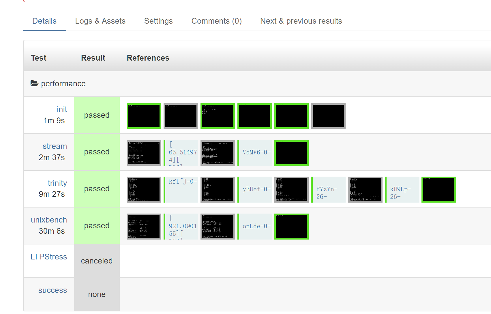
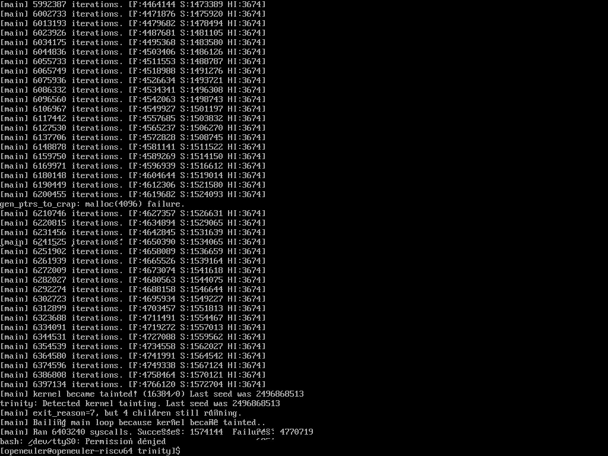

# 2023 年 9 月 第一周

## openEuler RISC-V 23.09 测试

- openQA 运行截图：

具体测试结果：

- performance/stream
  - 日志：[stream-2023-09-10.log](./202309_week1/stream-stream-2023-09-10.log)
  - 视频：[stream_unixbench-20230910.ogv](./202309_week1/stream_unixbench-20230910.ogv)
- performance/unixbench
  - 日志：[unixbench-2023-09-10.log](./202309_week1/unixbench-unixbench-2023-09-10.log)
  - 视频：[stream_unixbench-20230910.ogv](./202309_week1/stream_unixbench-20230910.ogv)
- long_stress/LTPStress
  - openQA 截图：
  - 日志：[LTPStress-2023-09-11.log](./202309_week1/LTPStress-2023-09-11.log)
  - 备注：
    - 原测试需要 24 小时，这里调整为 3 小时
- kernel/trinity
  - 日志：多次测试均超时，openQA 提前终止，没有导出日志
  - 截图：
  - 备注：
    - 测试需要在非 root 用户下运行，或者提供其他参数 (--angerout, --dropprivs), 这里选择采用 openeuler 用户做测试
    - 测试耗时不稳定，两次测试中，一次耗时 2.5 小时超时未导出日志（约 5000000 iteration），一次超过 4 小时仍未结束（>= 10000000 iteration）。
    - assert_script_run 函数有 timeout 参数，openQA 任务也有最大时间 MAX_JOB_TIME，暂时未查明是哪个导致超时，调整 openQA 默认 MAX_JOB_TIME 再次测试，相关文档 <https://open.qa/docs/#_changing_timeouts>

相关代码尚未提交 PR，保留在 fork 仓库

- <https://gitee.com/yan-mingzhu/os-autoinst-distri-openeuler/tree/feature%2Fperformance/>
- <https://gitee.com/yan-mingzhu/os-autoinst-needles-openeuler/tree/feature%2Fperformance/>

## 其他

- function/LTP：
  - 测试了在 openQA 中 reboot 的行为：正常，touch 创建的文件均有保留
    - [reboot.png](./202309_week1/openqa-reboot.png)
