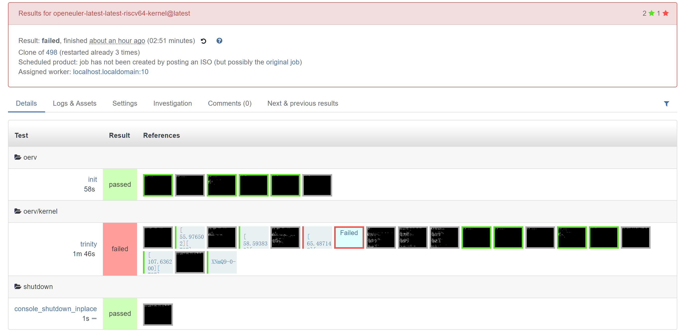
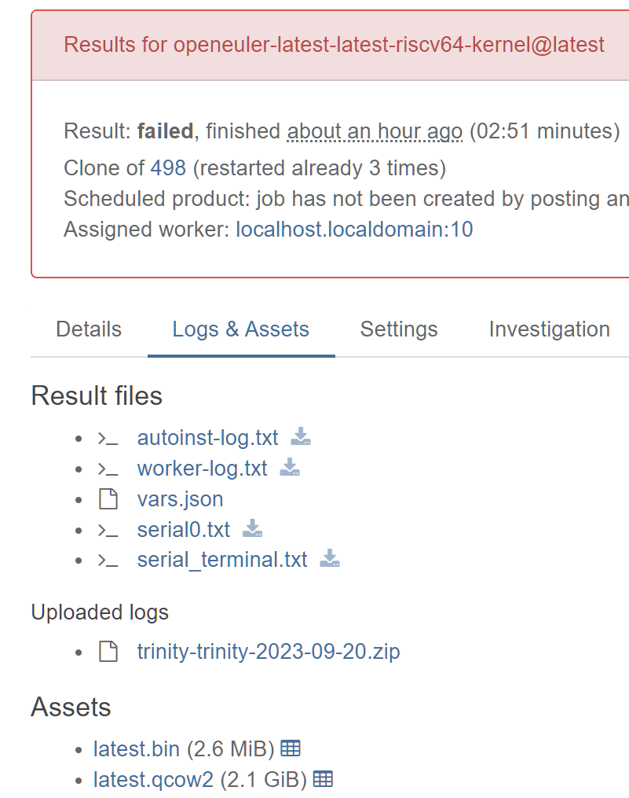

# 2023 年 9 月 第二周

## openEuler RISC-V 23.09 测试

- kernel/trinity
  - 问题 1: 任务超时
    - MAX_TIME_OUT, TIMEOUT_SCALE 均有影响，TIMEOUT_SCALE 需要根据测试机器的实际性能设置，MAX_JOB_TIME 根据任务时长直接设置
  - 问题 2: 测试建议在非 root 用户下运行，openQA 提供的函数无法正常运行 (报错导致任务失败)
    - 原因：`assert_script_run`(和 `script_run`) 函数会在命令末尾添加 `; echo xxxxxx > /dev/ttyS0`，普通用户默认没有权限写入 ttyS0。
    - 如果使用 `enter_cmd` 代替。虽然 `enter_cmd` 有默认的 `wait_still_screen` 等参数，但是无法准确拿到命令是否执行完成。两个 `enter_cmd` 命令先后执行时，如果第一个耗时很长，第二个命令可能尚未运行就超时
    - 最终采用在切换用户前 **为用户添加写入权限**
  - 问题 3: 运行失败 (超时等原因) 无法导出日志
    - 运行失败虚拟机环境不会丢失，可以通过设置 post_fail_hook 执行失败后的处理函数，导出部分日志
    - 下面的任务因为超时所以出错，依然能上传日志
    - 
    - 

PR:

- <https://gitee.com/yunxiangluo/os-autoinst-distri-openeuler/pulls/1>
- <https://gitee.com/yunxiangluo/os-autoinst-needles-openeuler/pulls/1>

## 其他

- openQA 多机测试
  - mmapi 包提供了 get_children 获取父子信息及同步等相关函数
