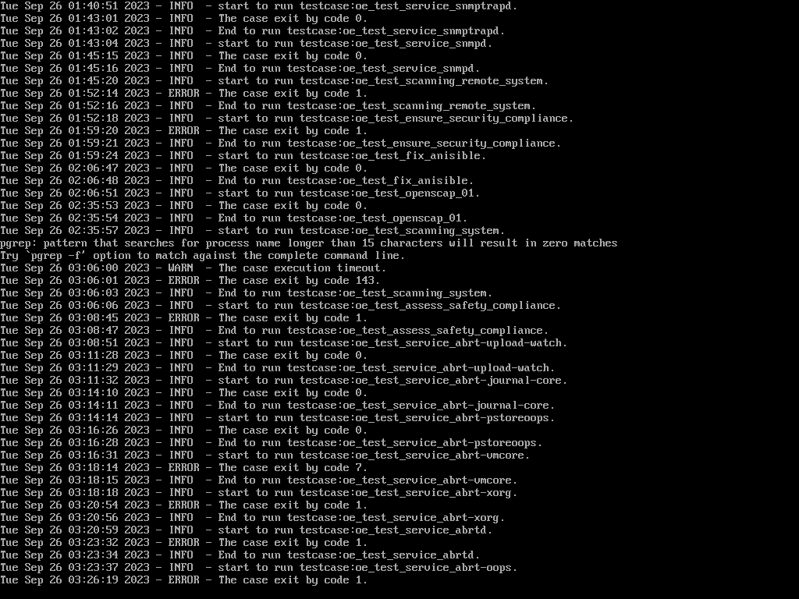
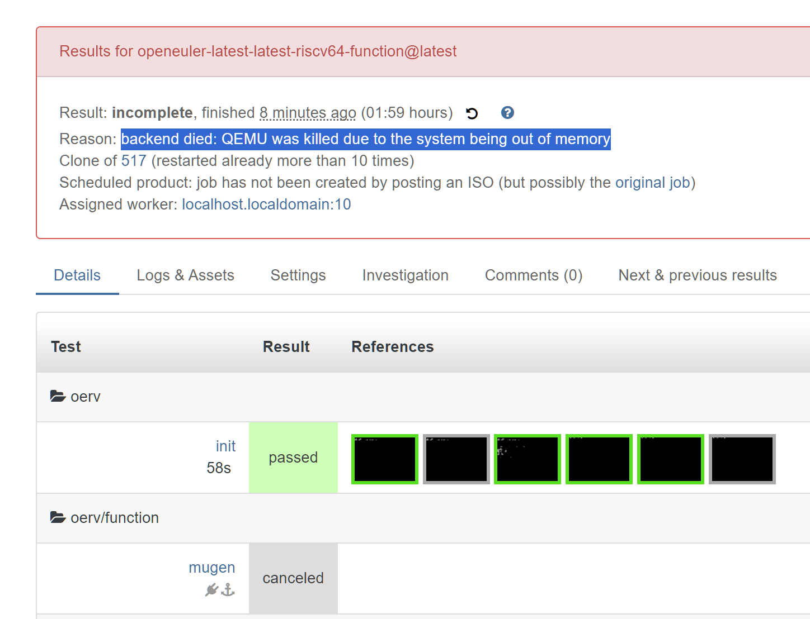

# 2023 年 9 月 第二周

## openEuler RISC-V 23.09 测试

- mugen
- 问题：
  - mugen 启动前需要配置环境变量文件，单机测试可以直接写 127.0.0.1，多机测试时暂时无法获取其他机器的 ip 地址

- 测试环境：本机 - 单机 - 测试所有用例
- 运行截图：
- 结果：qemu 内存爆，即使有 post_fail_hook 也无法输出日志 // NOTE

  

## 其他

- 多机测试方案 (待定)

  1. 考虑启动前手动设置 qemu 虚拟机 ip，然后直接用此 ip 生成配置文件（或者提前写好配置文件）
  2. 动态获取 ip。openQA 的 mmapi（Multi-Machine API）内置函数库提供了一些获取其他机器信息的方法。未提供文档，需要前往 [源代码仓库](https://github.com/os-autoinst/os-autoinst/blob/master/mmapi.pm) 寻找。例如 get_job_info 函数可以拿到任务的 Setting, vars 等信息。get_children 可以拿到其他机器的信息。

    ```perl
    =head2 get_job_info

        my $info = get_job_info($target_id);
        print $info->{settings}->{DESKTOP}

    Returns a hash containin job information provided by openQA server.

    =cut
    ```

    但是并没有直接提供获取机器 ip 的方法。需要进一步寻找

- 获取 ip

  - hacluster 包提供了 get_my_ip 函数获取本机 ip，但是运行报错，函数实际运行 `ip addr` 命令过滤 ip。报错原因：<FIXME: 待补充>
