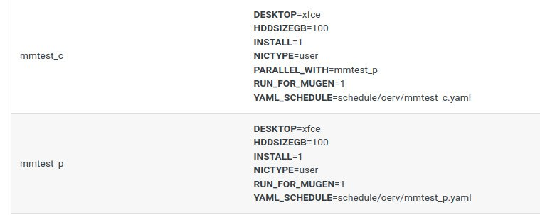
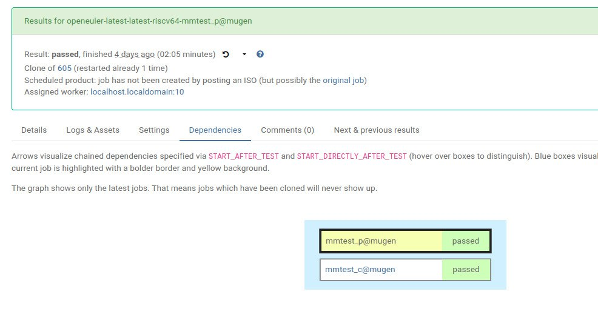
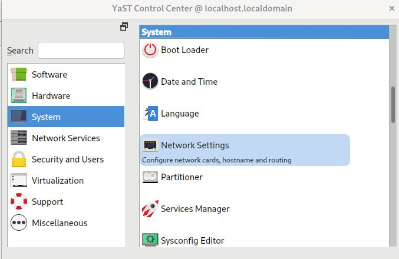
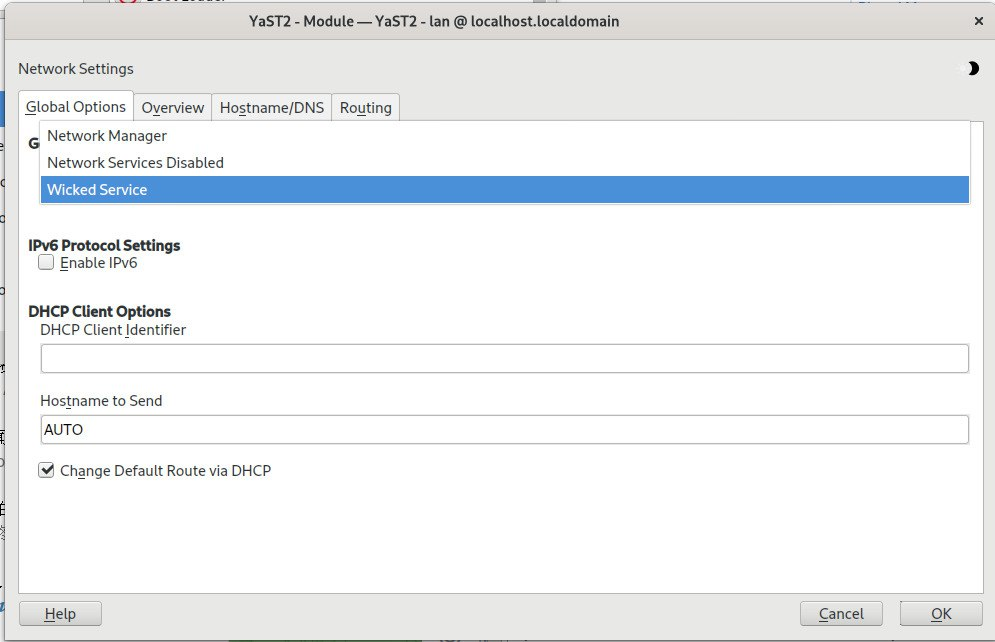
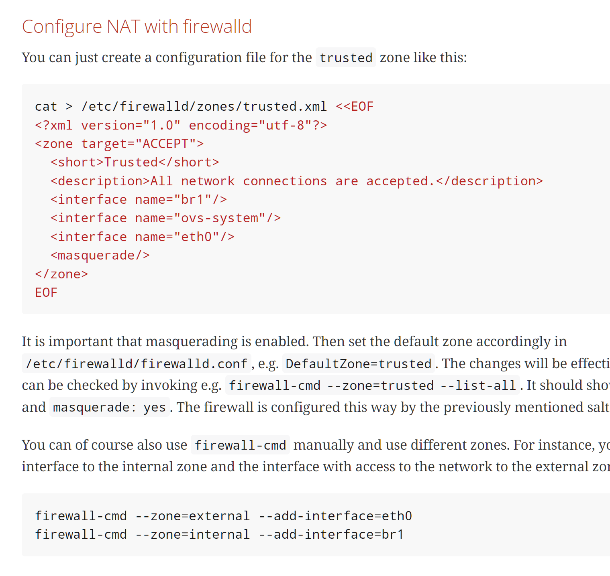

# 2023 年 10 月 第一周

## 本周工作

## openQA 多机测试调研

### 设置依赖关系

openQA 可以在 test suites 下为每一个测试之间设置依赖关系。依赖关系的声明取决于环境变量，共有下面三种依赖关系：

- 任务间级联关系（Chained dependencies）
  - 环境变量：START_AFTER_TEST, START_DIRECTLY_AFTER_TEST
- 任务间并行关系（Parallel dependencies）
  - 环境变量：PARALLEL_WITH
- 机器间依赖关系（Inter-machine dependencies）
  - TODO: 请参考官方文档

具体的设置方法：

1. 在 test suites 下为用例添加新的环境变量：

    

2. 在 job group 中同时添加两个测试（被依赖的任务必须有）:

    ```yaml
    ---

    defaults:
      riscv64:
        machine: mugen
        priority: 50

    products:
      openeuler-latest-riscv64-mugen-mmtest:
        distri: openeuler
        flavor: latest
        version: latest

    scenarios:
      riscv64:
        openeuler-latest-riscv64-mugen-mmtest:
            - mmtest_p
            - mmtest_c
    ```

3. 运行任务

    任务的运行方法没有变化：`openqa-cli api -X POST isos async=0 DISTRI=openeuler FLAVOR=v2 ARCH=riscv64 VERSION=22.03`

4. 结果：

    测试运行后应该多出一个 Dependencies tab 栏，显示任务间的关系：

    

### 支持库情况

> openQA 除了 testapi（提供鼠标，脚本运行，assert_screen 等基础方法）外，其他支持库均没有文档，只有部分示例代码

#### mmapi

mmapi 提供了获取父子任务信息的方法，例如 获取 parent job SETTING 页面各环境变量的示例代码：

from: _Example of mmapi: Getting info about parents / children_

```perl
use Mojo::Base "basetest";
use testapi;
use mmapi;

sub run {
    # returns a hash ref containing (id => state) for all children
    my $children = get_children();

    for my $job_id (keys %$children) {
      print "$job_id is cancelled\n" if $children->{$job_id} eq 'cancelled';
    }

    # returns an array with parent ids, all parents are in running state (see Job dependencies above)
    my $parents = get_parents();

    # let's suppose there is only one parent
    my $parent_id = $parents->[0];

    # any job id can be queried for details with get_job_info()
    # it returns a hash ref containing these keys:
    #   name priority state result worker_id
    #   t_started t_finished test
    #   group_id group settings
    my $parent_info = get_job_info($parent_id);

    # it is possible to query variables set by openqa frontend,
    # this does not work for variables set by backend or by the job at runtime
    my $parent_name = $parent_info->{settings}->{NAME}
    my $parent_desktop = $parent_info->{settings}->{DESKTOP}
    # !!! this does not work, VNC is set by backend !!!
    # my $parent_vnc = $parent_info->{settings}->{VNC}
}
```

#### lockapi

lockapi 提供了任务间同步的函数

- wait_for_children: 等待所有 children 完成
- mutex_wait（加锁），mutex_create（解锁）
- mutex_lock（加锁），mutex_unlock（解锁）所有其他任务在锁定期间都会阻塞

具体用法参考示例 <http://open.qa/docs/#_test_synchronization_and_locking_api>，或者 openQA 源代码

### 网络情况

注意：**涉及网络变更较大，强烈建议谨慎操作，如果使用虚拟机，建议提前打好快照**

官方文档：<http://open.qa/docs/#networking>

openQA 网络环境有三种

- QEMU User Networking
  - openQA 默认使用此模式运行
  - 可以访问 host 网络
  - qemu 之间网络互相隔离
- TAP（TAP 设备加网桥）
  - job 可以互相通信，且能访问外网
- VDE（暂未验证效果）
  - VDE 模式请参考官方文档，配置较为简单

下面介绍如何使用 TAP 模式进行多机测试：

1. 基本原理

    TAP 模式本身的设置与 openQA 并无太大关系，核心取决于 qemu 运行时需要添加参数 `-netdev tap0` 指定网络设备。如果为用例设置了环境变量 `NICTYPE=tap`，openQA 的 worker 会在启动 qemu 时自动加上这条配置。

2. 前置要求

    如果你的网络管理器是 NetworkManager，请替换为 wicked

    ```bash
    zypper -n in wicked
    ```

    
    

3. 配置 tap 网络

    - 使用官方提供的脚本（不建议）：<https://github.com/os-autoinst/os-autoinst/blob/master/script/os-autoinst-setup-multi-machine>，需要根据自己的网络情况，替换网卡配置（default=br0）为 eth0|enp0s3 等，网桥配置（default=br1）
    - 参考教程：<http://open.qa/docs/#_multi_machine_test_setup>
       注意事项：
       - 下图中的防火墙配置 interface 需要根据网卡更改，xml 文件的功能与下面的 firewall-cmd 命令功能相同 

    - 对官方文档补充解释
        1. 创建启动虚拟交换机，创建网桥，配置网桥

            ```bash
            zypper -n in openvswitch
            systemctl enable --now openvswitch
            zypper -n in os-autoinst-openvswitch
            systemctl enable --now os-autoinst-openvswitch
            ```

            修改 os-autoinst-openvswitch 默认使用的网桥（这里修改为 br1, 请配合下面代码内创建网桥一起食用）

            ```bash
            echo 'OS_AUTOINST_USE_BRIDGE=br1' > /etc/sysconfig/os-autoinst-openvswitch
            ovs-vsctl add-br br1
            ```

            注意这里 os-autoinst-openvswitch 可能会启动失败，因为脚本内部依然使用 br0 作为默认网桥，如果你使用 br1 网桥，则需要修改此服务对应 ExecStart 文件配置。
            这里我们刚刚创建网桥，可以在最后一步在修改并重启 os-autoinst-openvswitch

            > 按照官方脚本的逻辑，他似乎是想让你创建 br0 桥接到网卡，他会在建立 br1 网桥链接 br0 和 tapxxx, 这里的安装步骤没有建立 br0，直接使用 br1 桥接网卡和 tapxxx

        2. 为网桥配置虚拟端口 tap0

            ```bash
            cat > /etc/sysconfig/network/ifcfg-br1 <<EOF
            BOOTPROTO='static'
            IPADDR='10.0.2.2/15'
            STARTMODE='auto'
            ZONE='trusted'
            OVS_BRIDGE='yes'
            OVS_BRIDGE_PORT_DEVICE_0='tap0'
            EOF
            ```

        3. 为 worker 配置 tap 设备
             job 启动时可以按照环境变量自定义使用的 tap 设备。默认情况下 worker 会按照规则自动选择 tap 设备：> "tap" + ($worker_instance - 1), i.e. worker1 uses tap0, worker 2 uses tap1 and so on.

             官方文档使用 for 循环自动创建 60 个 tap 设备

             ```bash
             cat > /etc/sysconfig/network/ifcfg-tap0 <<EOF
             BOOTPROTO='none'
             IPADDR=''
             NETMASK=''
             PREFIXLEN=''
             STARTMODE='auto'
             TUNNEL='tap'
             TUNNEL_SET_GROUP='nogroup'
             TUNNEL_SET_OWNER='_openqa-worker'
             EOF
             instances=42
             for i in $(seq 1 $instances; seq 64 $((64+instances)); seq 128 $((128+instances))); do
                 ln -sf ifcfg-tap0 /etc/sysconfig/network/ifcfg-tap$i && echo "OVS_BRIDGE_PORT_DEVICE_$i='tap$i'" >> /etc/sysconfig/network/ifcfg-br1
             done
             ```

        4. 使用 firewall 配置 NAT 网络环境

             注意根据网卡 | 网桥 修改下面代码 eth0|br1

             ```bash
             cat > /etc/firewalld/zones/trusted.xml <<EOF
             <?xml version="1.0" encoding="utf-8"?>
             <zone target="ACCEPT">
               <short>Trusted</short>
               <description>All network connections are accepted.</description>
               <interface name="br1"/>
               <interface name="ovs-system"/>
               <interface name="eth0"/>
               <masquerade/>
             </zone>
             EOF

             systemctl restart firewalld
             ```

        5. 修改网卡配置

            ```bash
            # /etc/sysconfig/network/ifcfg-eth0
            BOOTPROTO='dhcp'
            BROADCAST=''
            ETHTOOL_OPTIONS=''
            IPADDR=''
            MTU=''
            NAME=''
            NETMASK=''
            REMOTE_IPADDR=''
            STARTMODE='auto'
            DHCLIENT_SET_DEFAULT_ROUTE='yes'
            ```

            重启网络

            ```bash
            systemctl restart wicked
            ```

        6. up 网桥

              `wicked ifup br1`

4. 配置 worker

    修改 worker class

    ```ini
    # /etc/openqa/workers.ini
    [global]
    WORKER_CLASS = qemu_riscv64,tap
    ```

    给 qemu 提供 tap 的访问权限

    ```bash
    zypper -n in libcap-progs
    setcap CAP_NET_ADMIN=ep /usr/bin/qemu-system-riscv64
    ```

    重启 worker

    ```bash
    systemctl restart openqa-worker@1
    ```

5. 启动测试

    配置环境变量启动

    ```ini
    NICTYPE=tap
    ```
