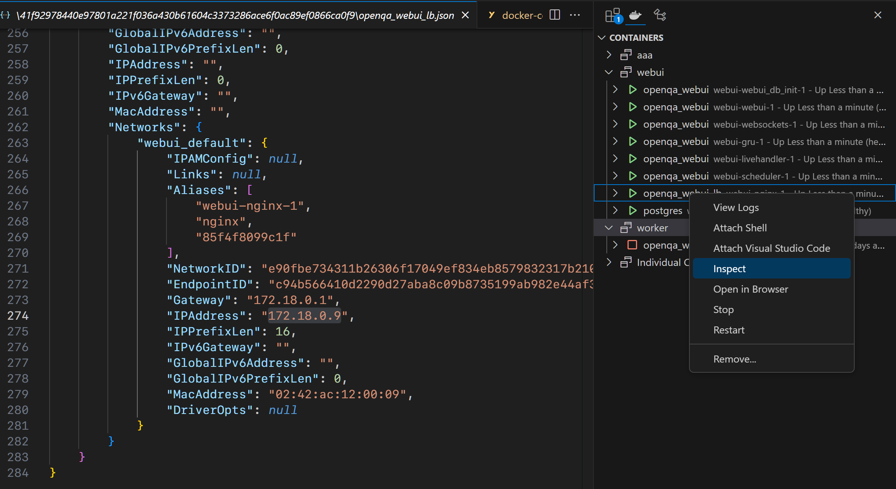

# 使用 docker 部署 openQA

## 部署

openQA 组件

1. openQA(webui 和 worker)
2. os-autoinst(实际启动虚拟机的组件)
3. os-autoinst-distri-xxx (测试代码)
4. needles(图片)

部署可以参考 [setup_openqa_with_opensuse_based_images_and_docker_compose](https://open.qa/docs/#_setup_openqa_with_opensuse_based_images_and_docker_compose).

[基于 fedora 的部署](https://open.qa/docs/#_setup_with_fedora_based_images) 已经没有官方人员维护, 建议不使用, 参考 <https://github.com/os-autoinst/openQA/issues/4608#issuecomment-1098061987>

主要代码所在文件夹: `container/webui`

## 配置测试

1. 官方提供了两个 docker-compose 分别用于 webui 和 worker 的启动, 在启动之后, 容器中已经包含了 [1-openQA] 和 [2-os-autoinst], 但是两者均是通过容器内的包管理器 zypper 安装

2. 现在需要安装的就是测试用例代码仓库 [3-os-autoinst-distri-xxx], 此仓库以 volumn 的形式挂载到了 `container/webui/workdir/data` 文件夹下. 用户需要

- 将 [官方示例测试代码仓库](https://github.com/os-autoinst/os-autoinst-distri-example) clone 到 `container/webui/workdir/data/tests` 目录下, 并重命名为例如 demo,

> 这个文件夹的名字是 distr(测试对象, 或者说发行版) 的名字, 不能随便起

- [4-needle] 其实不需要 clone, 只是因为里面包含的只有 json 和 图片, 把测试代码仓库和资源仓库分离更容易管理

3. 运行

    参考 [lvxiaoqian - deploy-openQA-for-riscv](https://gitee.com/lvxiaoqian/memo/blob/master/deploy-openQA-for-riscv.md) 在 web ui 配置

## FAQ

按照上述文档部署后依然会出先问题, 以下列出各个问题及解决方法

### webui 无法访问

官方代码中编写的 nginx config 似乎存在问题, 建议删除 `docker-compose.yaml` 下的 `replict` 配置:

```diff
-    deploy:
-      replicas: ${OPENQA_WORKER_REPLICAS}
+    # deploy:
+    #   replicas: ${OPENQA_WORKER_REPLICAS}
+networks:
+  default:
+    name: webui_default
+    driver: bridge
```

并修改 `nginx-entrypoint.sh`:

```diff
-replicas_cfg=""
-for i in $(seq "${OPENQA_WEBUI_REPLICAS:-2}"); do
-  replicas_cfg="server webui_webui_$i:9526;$replicas_cfg"
-done
+# replicas_cfg=""
+# for i in $(seq "${OPENQA_WEBUI_REPLICAS:-2}"); do
+#   replicas_cfg="server webui_webui_$i:9526;$replicas_cfg"
+# done
+
+replicas_cfg="server webui:9526;"
```

### webui 无法登录

配置 auth

```diff
--- a/container/webui/conf/openqa.ini
+++ b/container/webui/conf/openqa.ini
 [auth]
-method = OpenID
+method = Fake
```

### docker-compose 下 nginx 的映射端口必须设置为 80

webui 容器会根据 nginx 自己所在端口计算其他容器的所在端口, 仅仅修改 nginx 的映射端口会导致访问 webui 后无法正常访问 websocket 服务, 例如 livehandler.

具体代码如下, `assets/javascripts/openqa.js`:

```js
// returns an absolute "ws://" URL for the specified URL which might be relative
function makeWsUrlAbsolute(url, servicePortDelta) {
  // don't adjust URLs which are already absolute
  if (url.indexOf('ws:') === 0) {
    return url;
  }

  // read port from the page's current URL
  var location = window.location;
  var port = Number.parseInt(location.port);
  if (Number.isNaN(port)) {
    // don't put a port in the URL if there's no explicit port
    port = '';
  } else {
    if (port !== 80 || port !== 443) {
      // if not using default ports we assume we're not accessing the web UI via Apache/NGINX
      // reverse proxy
      // -> so if not specified otherwise, we're further assuming a connection to the livehandler
      //    daemon which is supposed to run under the <web UI port> + 2
      port += servicePortDelta ? servicePortDelta : 2;
    }
    port = ':' + port;
  }

  return (
    (location.protocol == 'https:' ? 'wss://' : 'ws:/') +
    location.hostname +
    port +
    (url.indexOf('/') !== 0 ? '/' : '') +
    url
  );
}
```

### worker 无法注册到 webui

`worker.ini` 需要配置 HOST IP, 对应的 ip 应该是 nginx 容器的 ip

由于官方代码把 webui 和 worker 放在了两个不同的 docker-compose 里, 想要是网络连通, 需要将他们配置到同一网络.

docker-compsoe 会自动创建 xxx_default 的 network, 所以这里设置 worker 使用 webui 网络

```diff
--- a/container/worker/docker-compose.yaml
+++ b/container/worker/docker-compose.yaml
@@ -12,5 +12,9 @@ services:
       - ./conf:/data/conf:ro
     environment:
       qemu_no_kvm: 1
-    deploy:
-      replicas: ${OPENQA_WORKER_REPLICAS}
+    # deploy:
+    #   replicas: ${OPENQA_WORKER_REPLICAS}
+networks:
+  default:
+    name: webui_default
+    driver: bridge
```

由于 nginx 容器的 ip 并不是固定的, 每次 docker-compose down 再 up 后(为了使某些修改的配置生效), 需要通过 `docker inspect` 去查看 nginx 容器自己的 ip:

```bash
docker inspect -f '{{range .NetworkSettings.Networks}}{{.IPAddress}}{{end}}' 2f33760db045
```

如果你使用 vscode 插件, 也可以直接再容器列表中右键菜单 inspect 查看

[例如此处的 ip 是 172.18.0.9]()

### unable to upgrade ws to command server

`worker.ini` 下的 `WORKER_HOSTNAME` 应该配置为 `worker`

如果依然报错, 可以参照官方文档 debug: [Steps to debug developer mode setup](https://open.qa/docs/#debugdevelmode)


### 导出 docker-compsoe 完整日志

```bash
docker-compose logs --no-color >& logs.txt
```

### 修改 openQA 源代码无效

官方提供了两个 docker-compose 分别用于 webui 和 worker 的启动, 在启动之后, 容器中已经包含了 openQA 和 os-autoinst, 但是两者均是通过容器内的包管理器 zypper 安装, 并非通过源代码构建

> 如果想修改源代码调试, 可以尝试进入容器, 并修改 `/usr/lib/os-autoinst` 下的文件, perl 作为脚本运行

### 无法运行 riscv 镜像

参考 <https://gitee.com/lvxiaoqian/memo/blob/master/deploy-openQA-for-riscv.md> 修改源代码

### live 页面无法显示

测试能够成功启动, 并且在测试结束后能够得到测试结果, 但是 webui live 页面无法显示, 参考 <https://github.com/os-autoinst/openQA/issues/5384>
