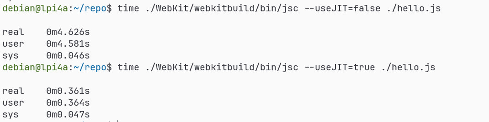

# 本月工作

## sail/act

- \[PR\] [riscv-non-isa/riscv-arch-test#539](https://github.com/riscv-non-isa/riscv-arch-test/pull/538) 为 ACT 添加 CI
- \[PR\] \[已合并\] [riscv-non-isa/riscv-arch-test#528](https://github.com/riscv-non-isa/riscv-arch-test/pull/528) (Fix brackets not closed) 修复括号未关闭
- \[PR\] [riscv-non-isa/riscv-arch-test#538](https://github.com/riscv-non-isa/riscv-arch-test/pull/539) [CTG] Add cli param env_dir
- \[PR\] [riscv-non-isa/riscv-arch-test#494-pr](https://github.com/riscv-non-isa/riscv-arch-test/pull/494): 合并原 riscv-ctg 和 riscof PR
- \[PR\] \[已合并\] [riscv-software-src/riscv-unified-db#204](https://github.com/riscv-software-src/riscv-unified-db/pull/204) (Fix broken links) 修复损坏的链接

## llvm/mlir

- \[PR\] [llvm/llvm-project#112018-pr](https://github.com/llvm/llvm-project/pull/112018) (\[mlir\]\[SPIRV\] Add decorateType method for MatrixType) 修复 [issue#108161](https://github.com/llvm/llvm-project/issues/108161) mlir 处理 `spirv::MatrixType`(带有 offset) 时崩溃
- \[PR\] [llvm/llvm-project#113877](https://github.com/llvm/llvm-project/pull/113877) (\[MLIR\]\[SPIRV\] Replace some auto to concrete type) 将一些自动类型替换为具体类型
- \[PR\] \[已合并\] [llvm/llvm-project#110464-pr](https://github.com/llvm/llvm-project/pull/110464) (\[mlir\]\[doc\]\[SPIR-V\] Add missing `>`) 修复文档

## webkit

- \[PR\] \[已合并\] [WebKit/WebKit#35129](https://github.com/WebKit/WebKit/pull/35129) (\[RISCV\] Fix typo about GPRReg def) 修复 Webkit 的 RISCV 寄存器定义
- [补丁](https://github.com/trdthg/WebKit/commit/09daa09e372b5fa2fe3e200a2f1d9e31b1c6908a)(后续会拆分提交 PR) 成功在荔枝派 4A 上编译出带有 JIT 的 JavaScriptCore(Webkit) JIT 测试效果如图 

## qemu

- 跟进 QEMU PR [邮件](https://www.mail-archive.com/qemu-devel@nongnu.org/msg1071306.html)

## qtrvsim

- [cvut/qtrvsim#123#issue](https://github.com/cvut/qtrvsim/issues/123#issuecomment-2408293563) 跟进，测试，回复 issue

## 会议

- tech-golden-model meeting [`10.07`, `10.28`](https://docs.google.com/document/d/1f9ihMT8vcmgijmvebMiHttwSbw9eY_MKkR9ea3CNFCg)
- Open Hour [10.30](https://docs.google.com/presentation/d/1MnfCX1FT25rxXckOh1Cso73QMe6BErAwx6YwW_I9tq0)
- 东亚双周会 [10.31](https://docs.google.com/presentation/d/1HRtLTPWYk-zvGWKgKYHCwRUCQHnA-_WF4u5GBhlHc2k/edit?usp=sharing)
